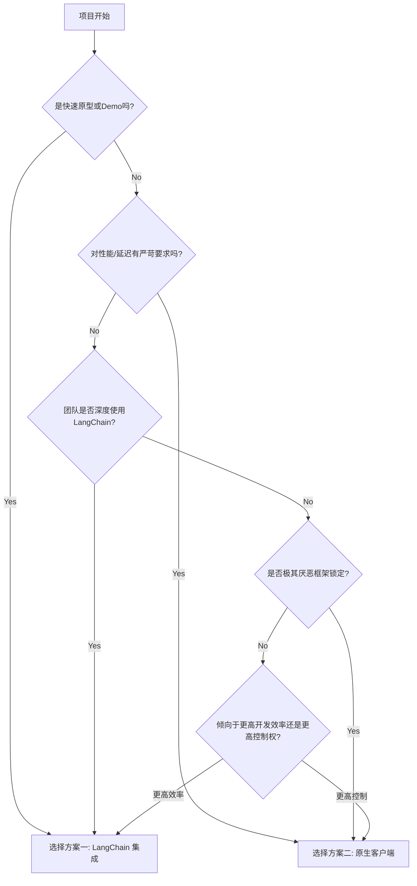

# 1.5 LangChain vs. DeepSeek：MCP 客户端开发与框架集成的终极对决

> 导语：在上一章，我们成功构建了一个遵循 MCP 协议的标准化工具服务。但“酒香也怕巷子深”，强大的工具服务需要同样强大的客户端来消费。当 Agent 的“大脑”（如 LangChain、DeepSeek）需要调用这些外部工具时，我们该如何设计和实现客户端，才能做到最高效、最优雅？本文将聚焦于 MCP 的客户端开发，深入探讨两种主流的集成模式：一是将 MCP 工具无缝融入 LangChain 生态，二是为原生大模型（以 DeepSeek 为例）打造轻量级、低耦合的 MCP 客户端。这不仅是一场技术方案的对决，更是一次关于框架、抽象与工程实践的深度思考。

## 目录
1.  **客户端的“初心”：我们到底需要什么？**
    *   回顾：MCP 客户端的核心职责
    *   两种集成思路的浮现：“深度集成” vs “轻量解耦”
    *   场景分析：什么时候选择 LangChain？什么时候选择原生客户端？
2.  **方案一：LangChain 的“拥抱”——将 MCP 工具深度集成**
    *   LangChain Tool 的本质：一个可执行的调用封装
    *   **实战：动态生成 LangChain Tool**
        *   第一步：通过 MCP 的 `/tools` 端点获取工具元数据
        *   第二步：为每个工具动态创建 `Tool` 对象和 `func` 调用包装
        *   第三步：将动态生成的工具列表喂给 `AgentExecutor`
    *   **优点分析**：
        *   生态兼容：无缝接入 LangChain 的 Agent、Chain 和 Memory 模块
        *   开发者友好：沿用熟悉的 LangChain 开发模式，学习成本低
    *   **缺点与反思**：
        *   框架锁定：代码与 LangChain 强绑定，难以迁移
        *   “黑魔法”：LangChain 的高度抽象有时会隐藏底层细节，调试困难
        *   性能开销：引入了额外的抽象层，可能存在性能损耗
3.  **方案二：原生 LLM 的“自由”——手写轻量级 MCP 客户端**
    *   返璞归真：回归 Function Calling 的本质循环
    *   **实战：为 DeepSeek 模型构建原生 MCP 调用循环**
        *   第一步：构建一个通用的 `ToolRegistry`（工具注册表）
        *   第二步：实现 Agent 的核心 `run` 循环（`while True`）
        *   第三步：在循环中调用 LLM，解析 `tool_calls`
        *   第四步：通过 `McpHttpClient` 执行工具调用
        *   第五步：将工具结果返回给 LLM，完成闭环
    *   **优点分析**：
        *   极致解耦：不依赖任何上层 Agent 框架，完全自由
        *   透明可控：每一行代码都在你的掌控之中，易于理解和调试
        *   高性能：没有多余的抽象层，只有纯粹的 HTTP 请求和 LLM 调用
    *   **缺点与反思**：
        *   “重复造轮子”：需要自己实现 Agent 循环、历史管理等本由框架提供的功能
        *   开发效率：对于复杂 Agent，开发和维护成本相对较高
4.  **终极对决：性能、灵活性与开发效率的权衡**
    *   Markdown 图表：两大方案关键指标对比
    *   决策树：如何根据你的项目需求选择合适的方案？
    *   混合模式：鱼与熊掌可以兼得吗？
5.  **代码重构与最佳实践：打造生产级的 MCP 客户端**
    *   将 `McpHttpClient` 封装成一个独立的 SDK
    *   引入缓存机制：为 `get_tools_spec` 和 `invoke` 增加缓存
    *   异步化改造：使用 `httpx` 和 `asyncio` 提升并发性能
6.  **总结：没有“银弹”，只有最合适的选择**

---

## 1. 客户端的“初心”：我们到底需要什么？

在我们深入代码之前，让我们先退后一步，思考一个根本性问题：对于一个 Agent 的“大脑”而言，一个理想的工具客户端应该具备哪些品质？

**回顾：MCP 客户端的核心职责**

上一章我们已经明确，一个 MCP 客户端至少要做好四件事：
1.  **服务发现**：知道要去哪里调用工具（Controller 的地址）。
2.  **工具发现**：知道有哪些工具可用，以及每个工具的“使用说明书”（JSON Schema）。
3.  **请求构造与执行**：能够将大脑的“调用意图”转换成标准的 `McpRequest` 并发送。
4.  **响应解析**：能够理解 `McpResponse` 并从中提取出有用的结果或错误信息。

**两种集成思路的浮现：“深度集成” vs “轻量解耦”**

基于这些核心职责，社区中逐渐形成了两种主流的客户端实现思路：

1.  **深度集成（Deep Integration）**：这种思路主张“既然我用了某个 Agent 框架（如 LangChain），就应该把所有东西都纳入它的体系”。具体做法是将外部的 MCP 工具严密地**包装**成该框架的原生组件（如 LangChain 的 `Tool` 对象）。Agent 在使用时，感觉不到自己是在调用一个远程的 MCP 服务，而像是在使用一个普通的本地工具。

2.  **轻量解耦（Lightweight Decoupling）**：这种思路主张“框架只是驱动 LLM 的一个辅助，核心的工具调用逻辑应该保持独立和纯粹”。具体做法是手写一个独立的、不依赖任何 Agent 框架的 `McpHttpClient`，然后在 Agent 的主循环中显式地、直接地调用这个客户端。Agent 清楚地知道自己在和外部的 MCP 服务对话。

**场景分析：什么时候选择 LangChain？什么时候选择原生客户端？**

这两种思路没有绝对的优劣，而是适用于不同的场景和团队偏好。

*   **选择深度集成（LangChain）的场景**：
    *   **快速原型验证**：你希望利用 LangChain 丰富的生态和开箱即用的 Agent 类型，快速搭建一个 Demo。
    *   **团队技术栈统一**：你的团队已经深度使用 LangChain，希望保持技术栈的一致性，降低新成员的学习成本。
    *   **需要复杂 Agent 能力**：你希望利用 LangChain 内置的记忆（Memory）、回调（Callback）、复杂 Chain 组合等高级功能。

*   **选择轻量解耦（原生客户端）的场景**：
    *   **生产环境与性能敏感**：你正在构建一个需要长期稳定运行、对性能和延迟有较高要求的生产级应用。
    *   **追求极致控制与透明**：你希望完全掌控 Agent 的每一次 LLM 调用和工具调用，便于精细的日志记录、调试和优化。
    *   **避免框架锁定**：你不希望自己的核心业务逻辑与某个特定的第三方框架强绑定，希望未来可以平滑地迁移到其他 LLM 或框架。
    *   **Agent 逻辑相对简单**：Agent 的核心任务是“接收指令 -> 调用工具 -> 回复”，不涉及复杂的多步骤规划或记忆。

接下来，我们将通过详细的代码实战，让你亲身体会这两种模式的差异。

## 2. 方案一：LangChain 的“拥抱”——将 MCP 工具深度集成

LangChain 的设计哲学是“万物皆可 Tool”。任何一个 Python 函数、一个 API 端点、甚至一个 SQL 查询，都可以被封装成一个 `Tool` 对象，然后无缝地接入 LangChain 的 Agent 生态。我们将利用这一特性，把远程的 MCP 工具“伪装”成本地的 LangChain `Tool`。

**实战：动态生成 LangChain Tool**

在上一章的 `langchain_mcp_integration.py` 文件中，我们已经实现了这个模式的核心逻辑。让我们再次回顾并深入解析这个过程。

**第一步：通过 MCP 的 `/tools` 端点获取工具元数据**

这是实现动态集成的关键。Agent 不再是硬编码地知道有哪些工具，而是在启动时“问”MCP 控制器。

```python
# mcp_client.py (上一章已实现)
# ...
class McpHttpClient:
    # ...
    def get_tools_spec(self) -> Dict[str, Any]:
        """获取控制器上所有工具的 OpenAI 格式描述"""
        response = requests.get(self.tools_url)
        response.raise_for_status()
        return response.json()

# langchain_mcp_integration.py
mcp_client = McpHttpClient("http://localhost:8000")
# Agent 启动时，自动发现所有可用的 MCP 工具
tools_spec_from_mcp = mcp_client.get_tools_spec().get("tools", [])
```

这一步实现了**工具的动态发现**，是构建可扩展 Agent 系统的重要前提。当你在 MCP 服务端注册一个新插件时，只需要重启 Agent 客户端，它就能自动获得这个新能力，无需修改任何客户端代码。

**第二步：为每个工具动态创建 `Tool` 对象和 `func` 调用包装**

我们遍历从服务端获取的工具元数据，为每一个工具动态地创建一个 `langchain.agents.Tool` 实例。

```python
# langchain_mcp_integration.py
from langchain.agents import Tool

langchain_tools = []
for tool_spec in tools_spec_from_mcp:
    # `tool_spec` 的内容是标准的 OpenAI Function/Tool JSON Schema
    # e.g., {"type": "function", "function": {"name": "mcp://weather/get_current_weather", ...}}
    
    mcp_uri = tool_spec["function"]["name"]
    
    # LangChain 的 Tool.name 字段有字符限制，不能包含 "://" 或 "/"
    # 我们需要转换一下格式，同时保证唯一性
    tool_name_for_langchain = mcp_uri.replace("mcp://", "").replace("/", ".")
    
    tool_description = tool_spec["function"]["description"]

    # --- 核心：为每个 Tool 创建一个闭包函数 ---
    def create_mcp_tool_func(uri):
        # 这个内部函数 `_mcp_tool_wrapper` 将会成为 Tool 的实际执行体
        def _mcp_tool_wrapper(**kwargs):
            # 当 LangChain Agent 调用此 Tool 时，实际上是在调用我们的 MCP 客户端
            return mcp_client.invoke(uri, **kwargs)
        return _mcp_tool_wrapper

    # 创建 Tool 对象
    new_tool = Tool(
        name=tool_name_for_langchain,
        description=tool_description,
        func=create_mcp_tool_func(mcp_uri),
        # 注意：我们没有在这里定义 args_schema，因为 LangChain Agent
        # 会从 LLM 返回的 tool_calls 中直接获取参数，然后传递给 func
    )
    langchain_tools.append(new_tool)
```
这段代码的精髓在于 `create_mcp_tool_func` 这个闭包。它为每个 MCP URI 创建了一个独一无二的 `_mcp_tool_wrapper` 函数。当 LangChain 的 `AgentExecutor` 决定调用名为 `weather.get_current_weather` 的工具时，它实际上执行的是 `new_tool.func`，这个 `func` 正是 `_mcp_tool_wrapper`，它内部已经“记住”了自己应该调用的 MCP URI 是 `mcp://weather/get_current_weather`。

**第三步：将动态生成的工具列表喂给 `AgentExecutor`**

最后一步水到渠成，将这个动态生成的 `langchain_tools` 列表传递给 Agent 即可。

```python
# langchain_mcp_integration.py
from langchain.agents import AgentExecutor, create_openai_tools_agent

# ... (初始化 llm 和 prompt)

agent = create_openai_tools_agent(llm, langchain_tools, prompt)
agent_executor = AgentExecutor(agent=agent, tools=langchain_tools, verbose=True)

# LangChain Agent 现在已经拥有了所有 MCP 工具的能力
agent_executor.invoke({"input": "What's the weather like in Paris?"})
```

**优点与缺点分析**

*   **优点**：这种模式的最大好处是**生态兼容性**。一旦 MCP 工具被包装成 LangChain `Tool`，你就可以像使用任何其他 LangChain 组件一样使用它，充分利用 LangChain 强大的生态，如 `LCEL` (LangChain Expression Language)、Memory 模块、Callbacks 等，快速构建复杂的应用。
*   **缺点**：引入了额外的抽象层，带来了**框架锁定**和**调试复杂性**。如果 Agent 的行为不符合预期，你很难判断问题是出在 LLM 的决策、LangChain Agent 的内部逻辑、你的 `Tool` 包装，还是底层的 MCP 服务上。整个调用链条变长了，透明度降低。

## 3. 方案二：原生 LLM 的“自由”——手写轻量级 MCP 客户端

现在，让我们切换到另一种截然不同的思路。我们抛开所有上层 Agent 框架，只保留最核心的三个组件：
1.  一个 LLM（如 DeepSeek）。
2.  一个通用的 `McpHttpClient`。
3.  一个我们自己编写的、清晰明了的 Agent 运行循环。

**返璞归真：回归 Function Calling 的本质循环**

Function Calling 的本质循环在第一章已经讲过，非常简单：
`while True: (LLM -> Tool Calls -> Execute Tools -> LLM)`
我们将亲手实现这个循环。

**实战：为 DeepSeek 模型构建原生 MCP 调用循环**

创建一个新文件 `native_mcp_agent.py`。

```python
# native_mcp_agent.py

import json
from openai import OpenAI
from typing import List, Dict, Any
from mcp_client import McpHttpClient # 依然复用我们的客户端

# --- 1. 初始化客户端和 LLM ---
mcp_client = McpHttpClient("http://localhost:8000")
# 同样，确保已配置 DeepSeek 的 Key 和 Base URL
llm_client = OpenAI() 

# --- 2. 获取并准备工具描述 ---
# 从 MCP 服务获取的已经是 OpenAI Tool 格式，可以直接使用
tools_for_llm = mcp_client.get_tools_spec().get("tools", [])
print("--- Tools sent to LLM ---")
print(json.dumps(tools_for_llm, indent=2))

# --- 3. 实现 Agent 的核心 `run` 循环 ---
def run_native_agent(user_prompt: str):
    
    messages: List[Dict[str, Any]] = [{"role": "user", "content": user_prompt}]
    
    while True:
        print("\n================ Agent is Thinking ================\n")
        
        # --- 步骤 3.1: 调用 LLM ---
        response = llm_client.chat.completions.create(
            model="deepseek-chat",
            messages=messages,
            tools=tools_for_llm,
            tool_choice="auto"
        )
        response_message = response.choices[0].message
        messages.append(response_message) # 将助手的回复加入历史记录
        
        # --- 步骤 3.2: 解析 tool_calls ---
        tool_calls = response_message.tool_calls
        
        if not tool_calls:
            # 没有工具调用，意味着 Agent 认为已经可以回答了
            print("--- Final Answer ---")
            print(response_message.content)
            return response_message.content

        # --- 步骤 3.3: 执行工具调用 ---
        print("--- Tool Calls Requested ---")
        for tool_call in tool_calls:
            mcp_uri = tool_call.function.name
            tool_args = json.loads(tool_call.function.arguments)
            
            # 直接、显式地调用 MCP 客户端
            tool_response = mcp_client.invoke(mcp_uri, **tool_args)
            
            print(f"Tool '{mcp_uri}' response: {tool_response}")
            
            # --- 步骤 3.4: 将工具结果包装并返回给 LLM ---
            messages.append(
                {
                    "tool_call_id": tool_call.id,
                    "role": "tool",
                    "name": mcp_uri,
                    "content": json.dumps(tool_response), # 确保内容是字符串
                }
            )

# --- 4. 运行 Agent ---
if __name__ == "__main__":
    run_native_agent("What's the weather in Tokyo and what are the available tools?")
```

**优点与缺点分析**

*   **优点**：这段代码的核心优势是**极致的简洁和透明**。
    *   **没有黑盒**：你可以清晰地看到每一次 `llm_client.chat.completions.create` 的调用，可以精确地打印出传入的 `messages` 和 `tools`。
    *   **完全解耦**：代码只依赖 `openai` 库（用于和 LLM 交互）和 `requests` 库（封装在 `McpHttpClient` 中）。没有对 LangChain 或任何其他 Agent 框架的依赖。
    *   **易于调试**：如果出错，问题定位非常简单。是 LLM 返回了错误的 `tool_calls`？还是 `mcp_client.invoke` 失败了？一目了然。

*   **缺点**：你需要**自己处理更多的事情**。在这个简单的例子中不明显，但当需求变得复杂时：
    *   **历史管理**：你需要自己实现如何截断或总结 `messages` 列表以避免超出 Token 限制。
    *   **错误处理**：你需要自己编写更复杂的 `mcp_client.invoke` 失败后的重试或降级逻辑。
    *   **并行调用**：虽然 LLM 可能一次返回多个 `tool_calls`，但我们的 `for` 循环是串行执行的。要实现并行执行，需要引入 `asyncio` 和 `httpx`，增加了复杂性。

## 4. 终极对决：性能、灵活性与开发效率的权衡

现在，让我们将这两种方案放在一起，进行一次正面的对比。

**Markdown 图表：两大方案关键指标对比**

| 指标             | 方案一：深度集成 (LangChain) | 方案二：轻量解耦 (原生) | 备注                               |
| :--------------- | :--------------------------- | :---------------------- | :--------------------------------- |
| **开发效率**     | ★★★★★ (高)                   | ★★★☆☆ (中)              | LangChain 封装了很多细节，上手快。 |
| **性能/延迟**      | ★★★☆☆ (中)                   | ★★★★★ (低)              | 原生方案没有额外抽象层的开销。     |
| **代码透明度**   | ★★☆☆☆ (低)                   | ★★★★★ (高)              | 原生方案的每一步都清晰可见。       |
| **可控性/调试**  | ★★☆☆☆ (难)                   | ★★★★★ (易)              | 透明度高，自然易于调试。           |
| **框架锁定**     | ★☆☆☆☆ (高)                   | ★★★★★ (无)              | 原生方案不依赖任何 Agent 框架。    |
| **生态/扩展性**  | ★★★★★ (强)                   | ★★☆☆☆ (弱)              | LangChain 拥有庞大的生态系统。     |
| **学习成本**     | ★★★☆☆ (中)                   | ★★☆☆☆ (低)              | LangChain 本身有一定学习曲线。     |

**决策树：如何根据你的项目需求选择合适的方案？**



**混合模式：鱼与熊掌可以兼得吗？**

当然可以。一种常见的生产实践是“开发用 LangChain，生产用原生”。
1.  在开发和原型阶段，使用方案一（LangChain 集成）快速迭代，验证业务逻辑。
2.  当应用进入性能优化和生产部署阶段时，参考 `AgentExecutor` 的源码，将核心的 Agent 循环剥离出来，用方案二（原生客户端）的方式重写，以获得最佳的性能和可控性。

LangChain 的 `verbose=True` 模式和 LangSmith 等可观测性工具，可以帮助你理解其内部工作流，从而为后续的“原生化”重构提供参考。

## 5. 代码重构与最佳实践：打造生产级的 MCP 客户端

无论你选择哪种方案，我们之前编写的 `McpHttpClient` 都可以进一步优化，使其更健壮、性能更高。

*   **封装成独立的 SDK**：将 `McpHttpClient` 及其依赖项打包成一个独立的 Python 包，在公司内部发布。这样，所有需要调用 MCP 服务的项目都可以直接 `pip install my-mcp-client`，而无需复制粘贴代码。
*   **引入缓存**：
    *   `get_tools_spec` 的结果通常在服务重启前是不变的，可以对其进行缓存（例如，使用 `functools.lru_cache` 或 Redis），避免每次 Agent 启动都发起一次 HTTP 请求。
    *   `invoke` 的结果也可以根据 `tool_uri` 和 `kwargs` 进行缓存，对于幂等的、重复的工具调用，可以极大地提升性能和降低成本。
*   **异步化改造**：当 LLM 一次返回多个 `tool_calls` 时，串行执行会成为瓶颈。使用 `asyncio`、`httpx` 和 `async def` 将 `McpHttpClient` 和 Agent 循环异步化，可以并发地执行所有工具调用，显著降低总耗时。

## 6. 总结：没有“银弹”，只有最合适的选择

LangChain 集成与原生客户端开发之争，本质上是软件工程中“框架”与“库”之争的延续。

*   **框架（Framework）** 如 LangChain，提供了“生活所需的一切”，规定了应用的结构（控制反转），你只需要在其中填充血肉。它为你做了很多决策，让你跑得更快，但也限制了你的自由。
*   **库（Library）** 如 `openai` 和 `requests`，是你工具箱里的“瑞士军刀”，你可以自由地组合它们来构建任何你想要的东西。你拥有完全的控制权，但也需要承担更多的设计和实现职责。

通过今天的“终极对决”，希望你不仅学会了两种 MCP 客户端的实现方法，更能理解它们背后的设计哲学和工程权衡。在你的下一个 Agentic AI 项目中，你将能够不再盲从，而是基于深刻的理解，做出最适合你的业务场景、团队能力和长远规划的技术选型。
