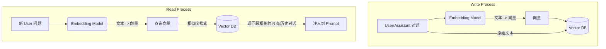

# 1.8 上下文管理秘籍：从零构建长短期记忆，让你的 Agent 不再健忘

> **导语**：欢迎来到我们第一周课程的最后一讲！我们已经学会了如何让 Agent 思考、行动，甚至如何塑造它的“人格”。但还有一个致命的弱点我们尚未解决：**遗忘**。随着对话的进行，不断增长的上下文会迅速撑爆大语言模型的 Token 限制，导致 Agent 像得了“健忘症”一样，忘记之前的对话内容。本文将授予你对抗“遗忘”的秘籍，带你深入探索上下文管理的各种策略，从最简单的截断，到智能的摘要，再到高级的向量化记忆，让你亲手为你的 Agent 构建起强大的长短期记忆系统。

## 目录
1.  **“我是谁？我在哪？”：为什么 Agent 会“健忘”？**
    *   上下文窗口（Context Window）：LLM 的“记忆容量”天花板
    *   Token 爆炸：当对话历史变得比小说还长
    *   遗忘的后果：重复提问、丢失关键信息、无法完成多步任务
2.  **短期记忆策略：简单粗暴但有效**
    *   **策略一：滑动窗口（Sliding Window）**
        *   原理：只保留最近的 K 轮对话
        *   代码实战：在我们的 GAME 框架中实现一个 `SlidingWindowMemory`
        *   优缺点分析：实现简单，但可能丢失对话初期的重要信息
    *   **策略二：Token 数量截断（Token-based Truncation）**
        *   原理：在每次调用 LLM 前，计算并保留最新的 N 个 Token
        *   代码实战：使用 `tiktoken` 库精确计算 Token
        *   优缺点分析：比滑动窗口更精确，但实现稍复杂
3.  **中长期记忆策略：智能摘要**
    *   **策略三：摘要记忆（Summarization Memory）**
        *   原理：当对话历史过长时，使用一次额外的 LLM 调用，将“旧”的对话内容总结成一段摘要
        *   “渐进式”摘要 vs “一次性”摘要
        *   代码实战：在 GAME 框架中实现 `SummarizationMemory`
        *   优缺点分析：能保留长期信息，但增加了 API 调用成本和延迟
    *   **策略四：对话知识图谱（Conversation Knowledge Graph）**
        *   原理：在对话过程中，动态地从对话中提取关键实体和关系，构建成知识图谱
        *   代码实...（这是一个非常高级的话题，本次作为概念介绍）
4.  **长期记忆策略：外部知识库（External Knowledge Base）**
    *   **策略五：向量数据库记忆（Vector Database Memory）**
        *   原理：将每一轮对话（或其摘要）转换成向量（Embedding），存入向量数据库（如 ChromaDB, FAISS）。在生成新回复前，根据当前用户问题，从数据库中检索最相关的历史对话片段。
        *   Mermaid 图：向量记忆的“存”与“取”
        *   代码实战：为 GAME 框架实现一个基于 ChromaDB 的 `VectorMemory`
        *   优缺点分析：最强大的长期记忆方案，但系统复杂度和维护成本最高
5.  **综合与权衡：构建混合记忆系统**
    *   没有银弹：不同记忆策略的适用场景
    *   **短期 + 长期**：使用 `InMemoryMemory` 存储最近对话，同时使用 `VectorMemory` 检索相关历史，是一种常见的生产级组合。
    *   代码实战：设计一个 `HybridMemory`，组合多种记忆策略
6.  **总结：让 Agent 拥有智慧的“记忆宫殿”**

---

## 1. “我是谁？我在哪？”：为什么 Agent 会“健忘”？

想象一下，你正在和我们之前构建的文件搜索 Agent 对话：
> **你**: "帮我找一下上周关于项目总结的那个 markdown 文件。"
> **Agent**: (调用工具...) "找到了，是 `project_alpha_summary.md`。内容是..."
> **你**: "很好，现在帮我把它复制到 'archive' 文件夹下。"
> **Agent**: (调用工具...) "好的，已复制。"
> ... 对话持续了 20 轮 ...
> **你**: "对于刚才那个文件，再帮我总结一下它的核心风险点。"
> **Agent**: "请问您说的是哪个文件？"

Agent “忘记”了你们最初讨论的 `project_alpha_summary.md`。这就是“上下文丢失”或“遗忘”现象。

**上下文窗口（Context Window）：LLM 的“记忆容量”天花板**

这个问题的根源在于，LLM 并不是真的“记住”了对话。在每一次 API 调用时，我们都必须把**全部**的历史对话记录，通过 `messages` 参数，重新发送给模型。

而每个模型都有一个固定的“上下文窗口”（Context Window），即它一次性能处理的 Token 总数上限。
*   `gpt-3.5-turbo`: 约 4k 或 16k Tokens
*   `gpt-4`: 约 8k 或 32k Tokens
*   `gpt-4-turbo`: 约 128k Tokens
*   `deepseek-chat`: 约 32k Tokens

**Token 爆炸**

一次典型的 `user` -> `assistant(tool_call)` -> `tool` 交互，可能轻松消耗掉几百甚至上千个 Token。随着对话轮次的增加，`messages` 列表会迅速膨胀。当其总 Token 数超过模型的上下文窗口时，API 调用就会直接失败。

**遗忘的后果**

为了避免 API 失败，我们必须在 `messages` 列表变得过长之前，对其进行“修剪”。而如何“修剪”，就直接决定了 Agent 的记忆能力。不恰当的修剪会导致：
*   **丢失关键信息**：像上面的例子一样，忘记了核心的讨论对象。
*   **重复提问**：忘记了用户已经提供过的信息，反过来再次向用户询问。
*   **无法完成多步任务**：对于需要跨越多轮对话才能完成的复杂任务，一旦中间状态被“遗忘”，任务就无法继续。

因此，上下文管理是构建任何非玩具级 Agent 的**核心挑战**。

## 2. 短期记忆策略：简单粗暴但有效

短期记忆策略的目标是，用最简单的方法，确保 `messages` 列表不会无限增长。

**策略一：滑动窗口（Sliding Window）**

这是最直观的策略：只保留最近的 K 轮对话。

*   **原理**：假设 K=5，那么 `messages` 列表中将永远只包含最近的 5 轮 `user` 和 `assistant` 的交流。当新的对话产生时，最旧的对话将被丢弃。System Prompt 通常需要被保留。

**代码实战：在 GAME 框架中实现 `SlidingWindowMemory`**

修改 `game_framework/components.py`，增加一个新的 Memory 实现。

```python
# game_framework/components.py (续)

class SlidingWindowMemory(BaseMemory):
    """只保留最近 K 轮对话的滑动窗口记忆"""
    def __init__(self, k: int = 10, system_prompt: str = ""):
        self.k = k
        self.system_prompt = system_prompt
        self._messages: List[Dict[str, Any]] = []

    def add_message(self, message: Dict[str, Any]):
        self._messages.append(message)
        # 当消息数量超过 k*2 (user+assistant) 时，进行截断
        # tool 消息和 tool_calls 消息我们暂时不计入 k
        user_assistant_msgs = [m for m in self._messages if m['role'] in ('user', 'assistant')]
        if len(user_assistant_msgs) > self.k * 2:
            # 找到需要保留的对话的起始点
            # 简单起见，我们直接从后往前取 k*2 条
            cut_point = len(self._messages) - self.k * 2
            # 实际上这种截断方式不精确，更鲁棒的方式是标记每一轮对话
            self._messages = self._messages[cut_point:]

    def get_messages(self) -> List[Dict[str, Any]]:
        if self.system_prompt:
            return [{"role": "system", "content": self.system_prompt}] + self._messages
        return self._messages
```
*   **优缺点分析**：
    *   **优点**：实现极其简单，计算开销小。
    *   **缺点**：非常“健忘”，一旦信息滑出窗口，就永久丢失了。对话初期设定的一些重要前提（比如“在接下来的对话中，我们只讨论 Python 语言”）很容易被忘记。

**策略二：Token 数量截断（Token-based Truncation）**

这种策略比滑动窗口更精确，它直接针对问题的根源——Token 数量。

*   **原理**：在调用 LLM 之前，计算 `messages` 列表的总 Token 数。如果超过了某个阈值（比如模型上限的 90%），就从**对话的开头**（System Prompt 之后）开始，逐条删除最旧的消息，直到总 Token 数降到阈值以下。

**代码实战：使用 `tiktoken` 库**
`tiktoken` 是 OpenAI 官方提供的 Token 计算库。

```bash
pip install tiktoken
```

```python
# game_framework/components.py (续)
import tiktoken

class TokenTruncationMemory(BaseMemory):
    """基于 Token 数量进行截断的记忆"""
    def __init__(self, model_name: str = "gpt-4", max_tokens: int = 4096, system_prompt: str = ""):
        self.system_prompt = system_prompt
        # 根据模型名称获取对应的编码器
        try:
            self.encoding = tiktoken.encoding_for_model(model_name)
        except KeyError:
            self.encoding = tiktoken.get_encoding("cl100k_base")
        self.max_tokens = max_tokens
        self._messages: List[Dict[str, Any]] = []

    def _get_token_count(self, messages: List[Dict[str, Any]]) -> int:
        """计算消息列表的总 Token 数"""
        count = 0
        for message in messages:
            # content 可能为 None (e.g. tool_calls)
            content = message.get("content") or ""
            count += len(self.encoding.encode(content))
        return count

    def add_message(self, message: Dict[str, Any]):
        self._messages.append(message)
        
        # 准备用于计算的完整消息列表
        full_messages = self.get_messages()
        current_tokens = self._get_token_count(full_messages)

        # 如果超出限制，从头开始删除（跳过 system prompt）
        while current_tokens > self.max_tokens:
            # 至少保留一条消息
            if len(self._messages) <= 1:
                break 
            
            # 删除第一条非 system 消息
            self._messages.pop(0)
            full_messages = self.get_messages()
            current_tokens = self._get_token_count(full_messages)

    def get_messages(self) -> List[Dict[str, Any]]:
        if self.system_prompt:
            return [{"role": "system", "content": self.system_prompt}] + self._messages
        return self._messages
```
*   **优缺点分析**：
    *   **优点**：精确控制 Token 数量，最大限度地利用上下文窗口。
    *   **缺点**：实现稍复杂，每次都需要重新计算 Token，有一定性能开销。同样无法避免关键信息的丢失。

## 3. 中长期记忆策略：智能摘要

短期记忆策略的核心是“丢弃”，而中长期记忆策略的核心是“压缩”。

**策略三：摘要记忆（Summarization Memory）**

*   **原理**：当对话历史变得过长时，不再粗暴地丢弃，而是用一个额外的 LLM 调用，将最旧的几轮对话“压缩”成一段摘要。然后用这段摘要替换掉原来的多轮对话。

**代码实战：在 GAME 框架中实现 `SummarizationMemory`**

```python
# game_framework/components.py (续)

class SummarizationMemory(BaseMemory):
    """达到一定长度后进行摘要的记忆"""
    def __init__(self, memory: BaseMemory, llm_engine: BaseEngine, summarize_threshold: int = 5):
        self.memory = memory
        self.llm_engine = llm_engine
        # 当 user/assistant 对话超过 5*2=10 条时触发摘要
        self.summarize_threshold = summarize_threshold * 2
        self.summary = ""

    def add_message(self, message: Dict[str, Any]):
        self.memory.add_message(message)
        
        current_messages = self.memory.get_messages()
        # 移除已有的摘要和 system prompt，只计算真实对话
        real_conv_len = len([m for m in current_messages if m['role'] not in ('system',)])
        
        if real_conv_len >= self.summarize_threshold:
            print("--- Summarizing conversation ---")
            # 我们将所有当前消息（除了最后一条）用于生成新摘要
            messages_to_summarize = [{"role": "system", "content": self.summary}] + current_messages[:-1]
            
            prompt = f"Please summarize the following conversation concisely:\n\n{messages_to_summarize}"
            
            # 使用一个独立的 LLM 调用来生成摘要
            # 注意：这里我们简化了流程，直接调用了 engine，实际应用中可能需要更复杂的逻辑
            summary_response = self.llm_engine.call_llm(
                messages=[{"role": "user", "content": prompt}],
                tools=[]
            )
            self.summary = summary_response.get("content", "")
            
            # 清空 memory，只保留最后一条消息
            last_message = current_messages[-1]
            self.memory = type(self.memory)() # 创建一个新的空 memory
            self.memory.add_message(last_message)
            print(f"New Summary: {self.summary}")

    def get_messages(self) -> List[Dict[str, Any]]:
        # 将摘要作为一条 system 消息放在开头
        base_messages = self.memory.get_messages()
        if self.summary:
            # 这里的角色也可以是 'system' 或一个自定义的角色
            return [{"role": "system", "content": f"This is a summary of the previous conversation: {self.summary}"}] + base_messages
        return base_messages
```
*   **优缺点分析**：
    *   **优点**：能够“记住”非常久远之前的信息，解决了短期记忆策略的核心痛点。
    *   **缺点**：**成本高，延迟高**。每次摘要都需要一次额外的 LLM API 调用。摘要过程本身也可能丢失细节。

## 4. 长期记忆策略：外部知识库

最高级的记忆形式，是将记忆“外包”给一个专门的外部系统，如向量数据库。

**策略五：向量数据库记忆（Vector Database Memory）**

*   **原理**：
    1.  **存储（Write）**：在对话过程中，将每一轮的 `user` 输入和 `assistant` 回复（或者它们的摘要），通过 Embedding 模型转换成一个高维向量。将这个向量连同原始文本一起，存入向量数据库（如 ChromaDB, FAISS, Pinecone）。
    2.  **检索（Read）**：在下一次对话开始前，将当前用户的最新问题也转换成一个向量。然后使用这个向量，在数据库中进行**相似度搜索**，找出与当前问题最相关的 N 条历史对话记录。
    3.  **注入（Inject）**：将检索到的这 N 条历史记录，作为“背景知识”或“参考资料”，注入到本次提交给 LLM 的 `messages` 列表中。

**Mermaid 图：向量记忆的“存”与“取”**



**代码实战：基于 ChromaDB 的 `VectorMemory`**

ChromaDB 是一个非常流行的、开源的、可本地运行的向量数据库。

```bash
pip install chromadb
```

```python
# game_framework/components.py (续)
import chromadb
from chromadb.utils import embedding_functions

class VectorMemory(BaseMemory):
    """使用向量数据库实现长期记忆"""
    def __init__(self, collection_name="agent_memory"):
        self.client = chromadb.Client() # 使用内存中的临时数据库
        # 使用 OpenAI 的 Embedding 功能 (需要配置 OPENAI_API_KEY)
        # 也可以替换成其他本地 embedding 模型
        openai_ef = embedding_functions.OpenAIEmbeddingFunction(
            model_name="text-embedding-3-small"
        )
        self.collection = self.client.get_or_create_collection(
            name=collection_name,
            embedding_function=openai_ef
        )
        self.message_count = 0

    def add_message(self, message: Dict[str, Any]):
        # 我们只存储 user 和 assistant 的最终回复
        if message['role'] in ('user', 'assistant') and message.get('content'):
            self.message_count += 1
            self.collection.add(
                documents=[message['content']],
                metadatas=[{"role": message['role']}],
                ids=[str(self.message_count)]
            )
            print(f"--- Added to VectorMemory, id={self.message_count} ---")

    def get_messages(self) -> List[Dict[str, Any]]:
        # VectorMemory 本身不直接返回消息列表
        # 它需要一个独立的 'retrieve' 方法
        return []

    def retrieve_relevant_memories(self, query: str, n_results: int = 3) -> List[Dict[str, Any]]:
        """根据查询，检索最相关的记忆"""
        results = self.collection.query(
            query_texts=[query],
            n_results=n_results
        )
        
        retrieved_docs = []
        if results and results['documents']:
            for i, doc in enumerate(results['documents'][0]):
                retrieved_docs.append({
                    "role": results['metadatas'][0][i]['role'],
                    "content": doc
                })
        print(f"--- Retrieved from VectorMemory: {retrieved_docs} ---")
        return retrieved_docs
```

*   **优缺点分析**：
    *   **优点**：提供了最强大、最持久的记忆能力。能够跨越非常长的时间和多次对话，找到相关的上下文。
    *   **缺点**：系统复杂度最高。引入了 Embedding 模型、向量数据库等新的外部依赖。检索到的信息是否真的对当前任务有用，也存在不确定性。

## 5. 综合与权衡：构建混合记忆系统

在实际生产中，很少只使用单一的记忆策略。最常见的做法是构建一个**混合记忆系统**。

**短期 + 长期：一种强大的组合**

一个典型的生产级 Agent 会同时拥有：
1.  一个**短期记忆**模块（如 `TokenTruncationMemory`），负责维护一个 Token 数量可控的、包含最近几轮完整交互（包括 `tool_calls`）的“工作区”。这保证了 Agent 能够流畅地完成当前正在进行的任务。
2.  一个**长期记忆**模块（如 `VectorMemory`），负责从海量的历史对话中，检索出与当前用户意图最相关的“背景知识”。

**代码实战：设计一个 `HybridMemory`**

`CoreAgent` 的 `run` 循环需要被改造，以适应这种混合记忆模式。

```python
# game_framework/agent.py (改造 CoreAgent)

class CoreAgent:
    def __init__(self, engine, short_term_memory, long_term_memory, tools):
        self.engine = engine
        self.short_term_memory = short_term_memory
        self.long_term_memory = long_term_memory # 我们的 VectorMemory 实例
        # ... (其他初始化)

    def run(self, user_prompt: str):
        # ... (添加 user_prompt 到短期和长期记忆)
        self.short_term_memory.add_message({"role": "user", "content": user_prompt})
        if self.long_term_memory:
            self.long_term_memory.add_message({"role": "user", "content": user_prompt})

        while True:
            # 1. 从短期记忆获取工作上下文
            messages = self.short_term_memory.get_messages()

            # 2. 从长期记忆检索相关历史
            relevant_memories = []
            if self.long_term_memory:
                relevant_memories = self.long_term_memory.retrieve_relevant_memories(user_prompt)

            # 3. 注入！将相关历史作为背景知识加入 Prompt
            if relevant_memories:
                memory_prompt = "You may find the following past conversation snippets relevant:\n"
                for mem in relevant_memories:
                    memory_prompt += f"- {mem['role']}: {mem['content']}\n"
                
                # 将其作为一条 system 消息注入
                # 注意：注入的位置很重要，通常放在最新的 user prompt 之前
                messages.insert(-1, {"role": "system", "content": memory_prompt})

            # ... (后续流程：调用 engine, 执行 tool, 更新记忆)
```

这个 `HybridMemory` 模式，让 Agent 既能聚焦于当下，又能博古通今，是构建真正智能、不健忘的 Agent 的关键。

## 6. 总结：让 Agent 拥有智慧的“记忆宫殿”

上下文管理是 Agentic AI 开发中一个充满挑战与创新的领域。它不存在一劳永逸的“银弹”，而是需要在**记忆效果**、**系统成本**和**实现复杂度**之间做出精妙的权衡。

*   对于**简单应用或原型**，从**短期记忆策略**（如 `TokenTruncationMemory`）开始就足够了。
*   对于需要**保持对话连贯性**的**多轮对话 Agent**，引入**摘要记忆**是一个不错的选择。
*   对于需要从**大量历史数据**中学习和检索的**生产级、知识密集型 Agent**，投资于**向量记忆**和**混合记忆系统**将带来巨大的长期回报。

掌握了这些“记忆秘籍”，你就拥有了为你的 Agent 构建一座坚不可摧的“记忆宫殿”的能力，让它在与用户的无限交互中，始终保持智慧与清醒。我们第一周的课程到此结束，恭喜你，你已经掌握了构建一个初级 Agent 所需的全部核心技能！
