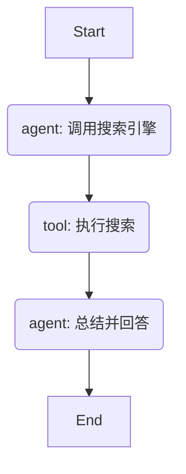

# 2.1 Agent 开发新范式！LangGraph 从链式思维到图状态的革命

> **导语**：欢迎进入课程的第二周！在第一周，我们聚焦于构建和强化**单个 Agent** 的能力。我们学会了如何让它使用工具、拥有记忆、并遵循我们的指令。然而，当我们面对真正复杂的、需要多个角色分工协作才能完成的任务时，单个 Agent 的线性思维模式便会捉襟见肘。此时，我们需要一种新的编程范式。本文将为你揭开 LangChain 团队推出的革命性框架——**LangGraph** 的神秘面纱。你将理解为什么从“链式”思维转向“图”思维，是构建复杂、可控、多智能体系统的关键一步，以及 LangGraph 是如何帮助我们实现这一飞跃的。

## 目录
1.  **LangChain 的“中年危机”：为什么我们需要 LangGraph？**
    *   回顾 LangChain 的 `AgentExecutor`：一个“while 循环”的抽象
    *   链式思维的局限性：线性的、单向的、难以控制的
    *   复杂任务的需求：循环、分支、回溯、人机协同
    *   LangGraph 的诞生：用“图”来编排 Agent 的工作流
2.  **核心思想：将 Agent 的工作流建模为状态图**
    *   “图”（Graph）是什么？节点（Nodes）与边（Edges）
    *   **节点（Nodes）**：执行工作的单元（一个函数或一个 LangChain `Runnable`）
    *   **边（Edges）**：连接节点，决定工作流的方向
    *   **状态（State）**：在图的节点之间流动的、可持久化的数据
    *   Mermaid 图解：一个简单的“搜索-回答”工作流的状态图表示
3.  **LangGraph 的核心组件：`StatefulGraph`**
    *   **定义状态（State）**：使用 `TypedDict` 或 Pydantic `BaseModel` 来定义一个全局的状态对象
    *   **添加节点（Nodes）**：使用 `graph.add_node()` 将函数注册为图的节点
    *   **设置入口点（Entry Point）**：使用 `graph.set_entry_point()` 决定工作流从哪里开始
    *   **添加常规边（Edges）**：使用 `graph.add_edge()` 连接两个节点，形成固定路径
    *   **添加条件边（Conditional Edges）**：使用 `graph.add_conditional_edges()` 实现工作流的动态路由和决策
    *   **设置出口点（Finish Point）**：使用 `graph.set_finish_point()` 告诉图何时结束
    *   **编译图（Compile）**：使用 `graph.compile()` 将图编译成一个可执行的 `Runnable` 对象
4.  **你好，LangGraph！构建第一个图应用**
    *   目标：一个简单的 ReAct (Reason-Act) 风格的 Agent
    *   代码实战：
        *   定义 `AgentState`
        *   创建 `call_model` 节点和 `call_tool` 节点
        *   定义一个 `should_continue` 函数作为条件边的决策逻辑
        *   组装并编译 `StatefulGraph`
        *   使用 `graph.stream()` 查看完整的执行流程
5.  **LangGraph vs. LangChain AgentExecutor：一场思维的革命**
    *   **控制权**：`AgentExecutor` 的循环是内置的“黑盒”；LangGraph 的循环是你亲手用节点和边定义的“白盒”。
    *   **灵活性**：LangGraph 可以轻易实现 `AgentExecutor` 难以做到的复杂模式，如多个 Agent 之间的循环协作、需要人工审核的暂停节点等。
    *   **可观测性**：`graph.stream()` 提供了对 Agent 每一步状态变化的“快照”，调试和监控变得前所未有的直观。
    .
6.  **总结：从“流水线工人”到“项目总指挥”**
    *   LangChain 是构建“流水线”的工具，适合线性任务。
    *   LangGraph 是绘制“组织架构图”的工具，适合需要调度、决策和协作的复杂项目。
    *   掌握 LangGraph，意味着你开始真正地“设计”和“编排”智能体，而不仅仅是“使用”它。

---

## 1. LangChain 的“中年危机”：为什么我们需要 LangGraph？

自诞生以来，LangChain 以其强大的 `Chain` 和 `Agent` 抽象，极大地降低了 LLM 应用的开发门槛。我们熟悉的 `AgentExecutor` 成为了构建 Agent 的事实标准。

**回顾 LangChain 的 `AgentExecutor`：一个“while 循环”的抽象**

让我们深入 `AgentExecutor` 的内部，它的核心逻辑本质上是一个封装好的 `while` 循环：

```python
# AgentExecutor 的伪代码
def run(prompt):
    messages = [HumanMessage(content=prompt)]
    while True:
        response = llm.invoke(messages, tools)
        if response is not a tool_call:
            return response.content
        
        # 是工具调用
        tool_results = []
        for tool_call in response.tool_calls:
            result = execute_tool(tool_call)
            tool_results.append(result)
        
        messages.append(response)
        messages.extend(tool_results)
```

这个循环非常强大，它完美地实现了 “思考 -> 行动 -> 观察” (ReAct) 的模式。但是，随着我们试图解决的任务越来越复杂，这种简单循环的局限性也日益凸显。

**链式思维的局限性**

`AgentExecutor` 的工作模式是一种**链式思维（Chain-of-thought）** 的直接体现。它的特点是：
1.  **线性**：流程总是 A -> B -> C，单向进行。
2.  **单体**：整个循环由**一个**决策者（LLM）驱动。
3.  **封闭**：循环的逻辑是预先内置在 `AgentExecutor` 中的，开发者很难介入或修改其内部的决策流程。

**复杂任务的需求**

然而，现实世界中的复杂任务，往往是非线性的，需要更复杂的协作模式：
*   **循环与回溯**：如果一个 Agent 发现自己走错了路，它可能需要**回到**之前的某个步骤，更换工具或策略重试。
*   **分支与条件**：根据某个工具的返回结果，工作流可能需要走向完全不同的分支。例如，`search_web` 返回了结果，则进入“总结”流程；如果返回“无结果”，则进入“更换关键词”流程。
*   **多 Agent 协作**：一个“规划” Agent 将任务分解成三步，然后交给三个不同的“执行” Agent **并行**处理，最后由一个“整合” Agent 汇总结果。
*   **人机协同**：在执行一个危险操作（如删除数据库）前，Agent 必须**暂停**，等待人类主管的批准才能继续。

这些复杂的、带有“控制流”的模式，用 `AgentExecutor` 很难，甚至不可能实现。强行实现只会让代码变得像“意大利面条”一样混乱不堪。

**LangGraph 的诞生：用“图”来编排 Agent 的工作流**

LangChain 团队敏锐地意识到了这一“中年危机”。他们意识到，当我们需要编排多个 `Chain` 或 `Agent` 时，我们需要的不再是“链条”，而是一张“地图”——也就是**图（Graph）**。

LangGraph 应运而生。它不是要取代 LangChain，而是作为 LangChain 的一个扩展，专门解决**多步骤、有循环、有决策的复杂 Agent 工作流编排**问题。它的核心思想是：**将 Agent 的工作流程，明确地定义为一个状态图**。

## 2. 核心思想：将 Agent 的工作流建模为状态图

LangGraph 借鉴了图论的基本概念，并将其与 Agent 的运行逻辑巧妙地结合起来。

**“图”（Graph）是什么？节点（Nodes）与边（Edges）**

一个图由**节点（Nodes）**和**边（Edges）**组成。
*   **节点 (Node)**：代表一个计算单元或一个工作步骤。在 LangGraph 中，一个节点通常就是一个 Python 函数或一个 LangChain `Runnable`。
*   **边 (Edge)**：代表节点之间的连接，它定义了工作流动的方向。

**状态（State）**

这是 LangGraph 最核心、最巧妙的抽象。在 LangChain 中，`Chain` 之间传递的是简单的字符串或字典。而在 LangGraph 中，整个图中流动的是一个**统一的、可累加的、全局的状态对象（State）**。

*   每个节点都可以读取这个 `State` 对象。
*   每个节点执行完毕后，不是返回一个全新的输出，而是返回一个**对 `State` 对象的修改**。LangGraph 会自动将这个修改与原有的 `State` **合并**。

这种设计的好处是巨大的：图中的任何一个节点，都可以轻易地访问到之前所有节点产生的所有信息，因为它们都汇集在同一个 `State` 对象中。这天然地解决了多步骤任务中状态管理和信息传递的难题。

**Mermaid 图解：一个简单的“搜索-回答”工作流的状态图表示**

让我们用一个简单的例子来理解“状态图”。假设一个 Agent 的工作流程是：
1.  接收用户问题。
2.  调用搜索引擎。
3.  调用 LLM 总结搜索结果并回答。

这个流程用 LangGraph 的状态图可以表示为：



*   **节点 (Nodes)**：这里有 `agent` 和 `tool` 两个角色的节点。
*   **边 (Edges)**：箭头代表了固定的工作流方向。
*   **状态 (State)**：一个 `State` 对象会在这些节点间流动。
    *   初始 `State` 可能包含 `{"user_question": "..."}`。
    *   经过 `agent` 节点后，`State` 变为 `{"user_question": "...", "tool_calls": [...]}`。
    *   经过 `tool` 节点后，`State` 变为 `{"user_question": "...", "tool_calls": [...], "tool_responses": [...]}`。
    *   最后，`agent` 节点再次被调用，读取 `tool_responses` 并生成最终答案，更新 `State` 为 `{"...": "...", "final_answer": "..."}`。

通过这种方式，我们把一个隐式的 `while` 循环，变成了一个显式的、可视化的图结构。

## 3. LangGraph 的核心组件：`StatefulGraph`

`langgraph.graph.StatefulGraph` 是我们构建图的核心类。它提供了一系列方法，让我们像搭乐高一样，一步步定义出我们的状态图。

**定义状态（State）**

一个 LangGraph 的图必须与一个状态定义绑定。最常用的方式是使用 Python 的 `TypedDict`。

```python
from typing import TypedDict, List, Dict, Any

class AgentState(TypedDict):
    # messages 是必须的，用于和 LLM 交互
    messages: List[Dict[str, Any]]
    # 你可以定义任何你需要的状态
    user_question: str
    search_results: List[str]
    final_answer: str
```
`AgentState` 定义了我们工作流中所有可能产生的数据的结构。

**添加节点（Nodes）**

每个节点都是一个接收当前 `State` 作为输入，并返回一个包含状态更新的字典的函数。

```python
from langgraph.graph import StatefulGraph

def my_node_function(state: AgentState) -> dict:
    # state 是当前的状态
    print(f"Current question: {state['user_question']}")
    
    # 执行一些操作...
    new_data = "some new data"
    
    # 返回一个字典，包含了对状态的更新
    # LangGraph 会自动将这个字典合并回主状态
    return {"some_new_field": new_data}

graph = StatefulGraph(AgentState)
graph.add_node("my_node", my_node_function)
```

**设置入口点（Entry Point）和出口点（Finish Point）**

*   `graph.set_entry_point("node_name")`: 定义了当图开始运行时，应该首先执行哪个节点。
*   `graph.set_finish_point("node_name")`: 定义了当执行到某个节点后，整个图的运行就结束。

**添加常规边（Edges）**

`graph.add_edge("source_node", "destination_node")`: 创建一条从 `source_node` 到 `destination_node` 的固定连接。当 `source_node` 执行完毕后，工作流总是会流向 `destination_node`。

**添加条件边（Conditional Edges）**

这是 LangGraph 最强大的功能之一，它让图具备了“决策”能力。

`graph.add_conditional_edges(source_node, path_function, path_map)`
*   `source_node`: 决策发生的节点。
*   `path_function`: 一个接收当前 `State` 作为输入的函数，它必须返回一个字符串，这个字符串决定了接下来应该走哪条路。
*   `path_map`: 一个字典，将 `path_function` 可能返回的字符串映射到具体的下一个节点名。

**示例：**
```python
def should_continue(state: AgentState) -> str:
    # 检查助手的最后一条消息是否包含工具调用
    if "tool_calls" in state["messages"][-1]:
        return "call_tools" # 如果有，就走向 "call_tools" 节点
    else:
        return "end" # 如果没有，就结束

graph.add_conditional_edges(
    "agent", # 决策发生在 "agent" 节点之后
    should_continue,
    {
        "call_tools": "tools", # "call_tools" 字符串映射到 "tools" 节点
        "end": "__end__"  # "__end__" 是一个特殊的名称，代表图的结束
    }
)
```

**编译图（Compile）**

当你定义完所有的节点和边之后，你需要调用 `graph.compile()`。这将把你的图定义转换成一个标准的 LangChain `Runnable` 对象。之后，你就可以像使用任何其他 `Runnable` 一样，通过 `.invoke()`, `.stream()`, `.batch()` 等方法来执行它。

## 4. 你好，LangGraph！构建第一个图应用

让我们用上面学到的组件，来构建一个简单的、具有 ReAct 风格的 Agent。

```python
# simple_langgraph_agent.py

from typing import TypedDict, Annotated, List, Dict, Any
from langchain_openai import ChatOpenAI
from langchain_core.messages import BaseMessage, ToolMessage
from langchain_core.tools import tool
from langgraph.graph import StatefulGraph, END

# --- 1. 定义工具 ---
@tool
def search(query: str):
    """Call to surf the web."""
    print(f"Searching for: {query}")
    # 模拟返回
    return "The weather in SF is sunny."

tools = [search]
llm = ChatOpenAI(model="deepseek-chat").bind_tools(tools)

# --- 2. 定义状态 ---
class AgentState(TypedDict):
    messages: Annotated[List[BaseMessage], lambda x, y: x + y]

# --- 3. 定义节点函数 ---

# a. 调用模型的节点
def call_model(state: AgentState):
    """Invokes the LLM."""
    messages = state['messages']
    response = llm.invoke(messages)
    return {"messages": [response]}

# b. 调用工具的节点
def call_tool(state: AgentState):
    """Invokes the tools."""
    last_message = state['messages'][-1]  # 获取模型的回复
    tool_results = []
    for tool_call in last_message.tool_calls:
        tool_output = search.invoke(tool_call['args'])
        tool_results.append(ToolMessage(content=str(tool_output), tool_call_id=tool_call['id']))
    return {"messages": tool_results}

# --- 4. 定义条件边函数 ---
def should_continue(state: AgentState):
    """Decides whether to continue or end."""
    last_message = state['messages'][-1]
    if not last_message.tool_calls:
        return "end"
    return "continue"

# --- 5. 构建图 ---
workflow = StatefulGraph(AgentState)

workflow.add_node("agent", call_model)
workflow.add_node("action", call_tool)

workflow.set_entry_point("agent")

workflow.add_conditional_edges(
    "agent",
    should_continue,
    {
        "continue": "action",
        "end": END,
    },
)

workflow.add_edge("action", "agent")

app = workflow.compile()

# --- 6. 运行图 ---
from langchain_core.messages import HumanMessage

inputs = {"messages": [HumanMessage(content="What is the weather in SF?")]}
# 使用 stream() 可以看到每一步的状态变化
for output in app.stream(inputs):
    for key, value in output.items():
        print(f"Output from node '{key}':")
        print("---")
        print(value)
    print("\n---\n")
```
当你运行这段代码，你会看到一个非常清晰的执行流程：
1.  **`agent` 节点被调用**：它调用 LLM，LLM 返回一个 `tool_calls`。
2.  **`should_continue` 被评估**：因为它检测到了 `tool_calls`，所以返回 `"continue"`。
3.  **工作流走向 `action` 节点**：`call_tool` 函数被执行，`search` 工具被调用。
4.  **`action` 节点执行完毕后，沿着我们定义的 `add_edge` 回到 `agent` 节点**。
5.  **`agent` 节点再次被调用**：这次 `messages` 中包含了工具的执行结果。LLM 基于这个结果生成了最终的自然语言回复。
6.  **`should_continue` 再次被评估**：这次，最新的消息中没有 `tool_calls`，所以它返回 `"end"`。
7.  **工作流走向 `END`**，程序结束。

我们用一种声明式的、可视化的方式，完美地复现了 `AgentExecutor` 的核心循环。

## 5. LangGraph vs. LangChain AgentExecutor：一场思维的革命

| 特性       | `AgentExecutor` (链式思维)                                   | `StatefulGraph` (图式思维)                                       |
| :--------- | :----------------------------------------------------------- | :--------------------------------------------------------------- |
| **控制流** | 隐式的 `while` 循环，逻辑写死在框架内部。                     | 显式的节点和边，循环和分支由开发者明确定义，完全可控。             |
| **状态管理** | 通过 `agent_scratchpad` 传递，不够灵活，难以访问中间状态。     | 统一的、可累加的 `State` 对象在图中流动，任何节点都可读写。        |
| **灵活性** | 难以实现循环、并行、人机交互等复杂模式。                     | 天生为复杂控制流设计，可以轻松实现任何你能想到的工作流。         |
| **可观测性** | 调试困难，像一个“黑盒”，需要依赖 Callbacks 或 LangSmith。        | `stream()` 方法提供了每一步状态变化的“快照”，极其便于调试和理解。 |
| **适用场景** | 简单的、线性的、单 Agent 的 ReAct 风格任务。                   | 复杂的、非线性的、多 Agent 协作的、需要精细控制的任务。          |

## 6. 总结：从“流水线工人”到“项目总指挥”

如果说，使用 LangChain 的 `AgentExecutor`，你的角色像一个**流水线工人**，你把零件（工具、LLM、Prompt）组装起来，然后按下开关，让流水线（`while` 循环）自动运转，但你无法改变流水线的结构。

那么，使用 LangGraph，你的角色就升维成了**项目总指挥**或**系统架构师**。你不再是简单地使用一个循环，而是在一张白板上，亲手绘制你的团队（多个 Agent）的**组织架构图（Graph）**。你定义了每个成员（Node）的职责，以及他们之间的汇报关系和协作流程（Edges）。

掌握 LangGraph，标志着你已经从一个 Agent 的“使用者”，蜕变为一个复杂 Agent 系统的“设计者”。你开始拥有了驾驭多个智能体，让它们分工、协作、甚至相互辩论，以解决单一 Agent 无法企及的宏大任务的能力。这，正是通往更高级 Agentic AI 开发的必经之路。
