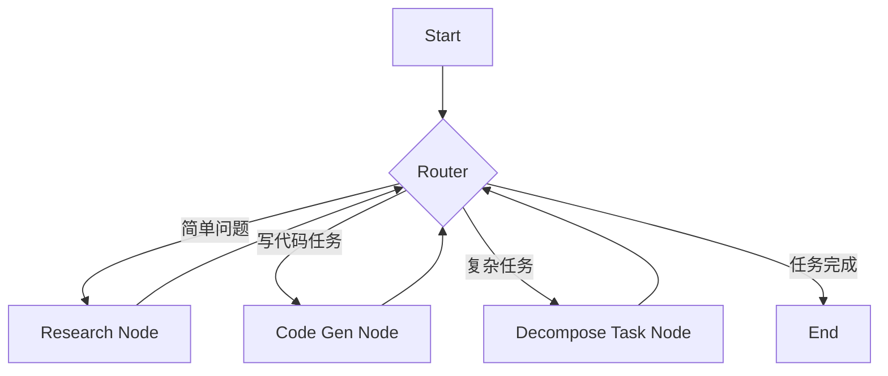

# 2.3 让 Agent 学会“思考”：用 LangGraph 构建智能路由与记忆管理系统

> **导语**：在上一个教程中，我们构建了一个可以在两个工具间进行选择的 Agent。但它的“思考”能力还很初级：要么调用工具，要么结束。它的“记忆”是短暂的，程序一停，所有对话历史都烟消云散。要构建能够处理复杂、长期任务的 Agent，我们必须赋予它更高级的“思考”能力（智能路由）和更持久的“记忆”（持久化）。本文将带你深入 LangGraph 的高级功能，学习如何构建一个可以根据任务状态动态路由的、拥有持久化记忆的智能 Agent，让你的 Agent 真正学会“思考”和“铭记”。

## 目录
1.  **超越二元决策：从“是否调用工具”到“下一步该做什么？”**
    *   回顾：简单的条件边 `should_continue`
    *   新需求：一个能够进行网络搜索、代码编写、任务分解的“全能”研究员 Agent
    *   智能路由的必要性：根据任务类型，将工作流导向不同的“专家”节点
2.  **构建“全能研究员” Agent 的蓝图**
    *   **专家节点**：
        *   `web_search_node`: 负责网络搜索的专家
        *   `code_gen_node`: 负责编写代码的专家
        *   `decompose_task_node`: 负责分解复杂任务的“项目经理”
    *   **状态设计**：在 `AgentState` 中加入 `task` 和 `plan` 字段
    *   **路由逻辑**：设计一个更复杂的 `router` 函数，决定任务的流向
    *   Mermaid 图：可视化我们的多节点、多路径工作流
3.  **代码实战：实现智能路由**
    *   第一步：定义多个“专家”工具和对应的 Agent `Runnable`
    *   第二步：编写 `router` 函数，利用 LLM 进行“元决策”（meta-decision）
    *   第三步：使用 `add_conditional_edges` 构建多分支的图
4.  **为 Agent 安装“记忆海马体”：实现持久化记忆**
    *   为什么需要持久化？长任务、人机协作、故障恢复
    *   LangGraph 的检查点机制（Checkpointer）
    *   **代码实战：接入 `SqliteSaver`**
        *   安装 `psycopg2-binary` (虽然是 Sqlite，但依赖需要)
        *   创建 `SqliteSaver` 实例
        *   在 `app.compile()` 中传入 `checkpointer`
        *   使用 `thread_id` 来保存和恢复特定对话的状态
5.  **运行拥有持久化记忆的智能路由 Agent**
    *   发起一个需要搜索的任务，观察其走向 `web_search_node`
    *   中断程序，再用同一个 `thread_id` 重新发起一个新任务
    *   观察 Agent 如何“记起”之前的对话，并正确执行新任务
6.  **总结：从“执行者”到“思考者”的进化**

---

## 1. 超越二元决策：从“是否调用工具”到“下一步该做什么？”

在 `2.2` 节中，我们的 Agent 的决策逻辑非常简单，由一个 `should_continue` 函数实现：

```python
def should_continue(state):
    if state['messages'][-1].tool_calls:
        return "continue" # 去执行工具
    else:
        return "end" # 结束
```

这是一个**二元决策**。Agent 的世界里只有两条路：调用工具，或者结束对话。这对于简单任务是足够的。但如果我们想构建一个更强大的 Agent，比如一个“全能研究员”，它的工作流会复杂得多。

**新需求：“全能研究员” Agent**

想象一个研究员 Agent，它需要能够：
1.  当面对一个简单问题时，直接利用其知识或网络搜索来回答（**Research**）。
2.  当被要求编写一段代码来实现某个功能时，它应该进入代码编写模式（**Code Generation**）。
3.  当面对一个极其宏大和模糊的任务，比如“帮我分析一下最近 AI 芯片的市场趋势”时，它不应该直接开始搜索或写代码，而应该首先**分解任务**，制定一个计划（**Task Decomposition**）。

**智能路由的必要性**

这就要求我们的 Agent 不能只有一个简单的“是/否”决策，而是需要一个**多路选择**的决策能力。它需要像一个项目经理一样，在每个步骤之后评估当前的状态，然后决定：“OK，搜索已完成，根据结果，我发现需要写一段代码来分析数据，那么下一步应该走向‘代码生成’节点。”

这就是**智能路由（Intelligent Routing）**。我们不再仅仅决定“是否继续”，而是决定“**接下来要去哪里**”。

## 2. 构建“全能研究员” Agent 的蓝图

**专家节点**

为了实现上述功能，我们需要设计多个各司其职的“专家”节点：

*   **`research_node`**: 一个基础的 ReAct 风格 Agent，负责处理搜索和回答简单问题。
*   **`code_gen_node`**: 一个专门用于生成和测试代码的 Agent 或 `Chain`。
*   **`decompose_task_node`**: 一个接收复杂任务，并将其分解为一系列具体步骤的 `Chain`。
*   **`router_node`**: 这是我们新的“大脑”，一个“元决策者”。它的工作不是解决问题，而是**决定应该由哪个专家节点来解决问题**。

**状态设计**

我们的 `AgentState` 需要扩展，以容纳更丰富的信息：

```python
class ResearchState(TypedDict):
    task: str # 当前需要解决的核心任务
    plan: List[str] # 任务分解后的计划
    messages: Annotated[List[BaseMessage], operator.add]
    sender: str # 记录当前是哪个节点在工作
```

**路由逻辑**

`router` 函数将变得更复杂。它会调用一次 LLM，向其描述当前的任务和可用的专家节点，然后让 LLM 来决定下一步该走哪条路。

**Mermaid 图：可视化我们的多节点、多路径工作流**


这个图清晰地展示了 `Router` 节点作为中央枢纽，根据任务性质将工作流动态地分发给不同的专家处理，处理完后再回到 `Router` 进行下一步决策。

## 3. 代码实战：实现智能路由

让我们来实现这个更复杂的路由逻辑。

**第一步：定义“专家” Agent (简化版)**

为了聚焦于路由逻辑，我们将“专家”进行简化。我们不再创建多个完整的 Agent，而是用一个 LLM 调用加上一个特定的 Prompt 来模拟不同专家的行为。

```python
# smart_router_agent.py

from langchain_core.prompts import ChatPromptTemplate
from langchain_openai import ChatOpenAI

# 模拟的“代码生成”专家
code_gen_prompt = ChatPromptTemplate.from_messages(
    [
        ("system", "You are a senior python programmer. Your task is to write python code to accomplish the user's goal. You ONLY respond with the syntactically correct python code. Do not add any explanation or decoration."),
        ("user", "{task}")
    ]
)
llm = ChatOpenAI(model="deepseek-chat")
code_gen_runnable = code_gen_prompt | llm

# 模拟的“研究”专家 (这里我们复用 2.2 节的 Agent)
# 为了简化，我们假设 research_agent 是一个已经存在的、可调用的黑盒
# from multi_tool_agent import app as research_agent

# 模拟的“任务分解”专家
decompose_prompt = ChatPromptTemplate.from_messages(
    [
        ("system", "You are a project manager. Your task is to break down a complex user request into a sequence of simple, actionable steps. Respond with a list of steps."),
        ("user", "{task}")
    ]
)
decompose_runnable = decompose_prompt | llm
```

**第二步：编写 `router` 函数**

`router` 函数是核心，它本身也是一次 LLM 调用，进行“元决策”。

```python
# smart_router_agent.py (续)
from typing import Literal
from langchain_core.pydantic_v1 import BaseModel

# 定义路由决策的数据结构
class RouteQuery(BaseModel):
    """Route a user query to the most relevant sub-agent."""
    destination: Literal["python_coder", "researcher", "task_decomposer", "final_answer"]

# 使用 Function Calling 来让 LLM 做出结构化的路由决策
structured_llm = llm.with_structured_output(RouteQuery)

# 创建路由 prompt
router_prompt = ChatPromptTemplate.from_messages(
    [
        ("system", "You are an expert at routing a user query to a sub-agent. Given the user query, route it to the agent that is best suited to handle it."),
        ("user", "Query: {query}\n\nAvailable agents:\n- python_coder: A python programmer that can write code to accomplish a goal.\n- researcher: A research assistant that can search the web to answer questions.\n- task_decomposer: A project manager that can break down a complex task into a sequence of simpler steps.")
    ]
)

# 将 prompt 和结构化 LLM 链接起来，创建路由 Runnable
router_runnable = router_prompt | structured_llm

def router_node(state: AgentState):
    print("--- Calling Router Node ---")
    query = state['messages'][-1].content
    # 调用 LLM 做出路由决策
    route = router_runnable.invoke({"query": query})
    
    print(f"Route decision: {route.destination}")
    
    if route.destination == "python_coder":
        return "run_code_gen"
    elif route.destination == "researcher":
        return "run_research"
    elif route.destination == "task_decomposer":
        return "run_decompose"
    else:
        return "end"

```

**第三步：组装新的图**

```python
# smart_router_agent.py (续)

# ... (定义 AgentState, 各种专家 node 函数) ...

# 假设我们已经定义了 handle_code_gen, handle_research, handle_decompose 等节点函数
def handle_code_gen(state): ...
def handle_research(state): ...
def handle_decompose(state): ...

workflow = StatefulGraph(AgentState)

# 添加节点
workflow.add_node("router", router_node)
workflow.add_node("code_generator", handle_code_gen)
workflow.add_node("researcher", handle_research)
workflow.add_node("decomposer", handle_decompose)

# 设置入口点
workflow.set_entry_point("router")

# 添加条件边
workflow.add_conditional_edges(
    "router",
    lambda state: state['sender'], # 这里的路由逻辑简化了，直接读取 state['sender']
    {
        "run_code_gen": "code_generator",
        "run_research": "researcher",
        "run_decompose": "decomposer",
        "end": END
    }
)

# 所有专家节点执行完毕后，都回到 router 进行下一步决策
workflow.add_edge("code_generator", "router")
workflow.add_edge("researcher", "router")
workflow.add_edge("decomposer", "router")

app = workflow.compile()
```
*注意：为了保持教程的清晰性，以上代码是示意性的。完整的、可运行的代码会更长，但核心逻辑就是如此。*

通过这种方式，我们构建了一个以 `router` 为核心的、星形的拓扑结构，实现了真正的智能路由。

## 4. 为 Agent 安装“记忆海马体”：实现持久化记忆

到目前为止，我们所有的 Agent 记忆都存在于内存中。程序一旦重启，万事皆空。这对于需要处理长耗时任务、或者需要与用户进行多天持续对话的场景是无法接受的。

**LangGraph 的检查点机制（Checkpointer）**

LangGraph 提供了一个优雅的解决方案：**检查点（Checkpointer）**。

Checkpointer 的作用就像是为我们流动的“状态篮子”（`State`）在每个节点执行完毕后，拍一张“快照”，并将其存入一个持久化的后端存储中（如 SQLite, Redis, Postgres）。

**代码实战：接入 `SqliteSaver`**

让我们为 `2.2` 节中的 `multi_tool_agent` 添加持久化记忆。

**安装依赖**
```bash
# LangGraph 使用 sqlalchemy 和 aiosqlite 与 sqlite 交互
# psycopg2-binary 是 sqlalchemy 的一个依赖，虽然名字看起来和 postgres 相关
pip install sqlalchemy aiosqlite psycopg2-binary
```

**修改代码**
打开 `multi_tool_agent.py`，在最后添加以下代码：

```python
# multi_tool_agent.py (在文件末尾)

from langgraph.checkpoint.sqlite import SqliteSaver

# 1. 创建一个 SqliteSaver 实例
# 它会在当前目录下创建一个 memory.sqlite 的数据库文件
memory_saver = SqliteSaver.from_conn_string("sqlite:///memory.sqlite")

# 2. 在编译图时，传入 checkpointer
app = workflow.compile(checkpointer=memory_saver)


# 3. 使用 `thread_id` 来标识和恢复对话
# 想象一下，每个用户或每个对话任务都有一个唯一的 ID
thread_id_1 = "user-123-task-abc"
config = {"configurable": {"thread_id": thread_id_1}}

# --- 运行并持久化 ---
print("\n\n--- Running with Persistence (Run 1) ---")
# 第一次运行
inputs1 = {"messages": [HumanMessage(content="What's on Elon Musk's mind recently?")]}
for output in app.stream(inputs1, config):
    # ... (打印输出)

# 假设程序在这里中断，然后重启
print("\n\n--- App Restarted ---")
print("--- Running with Persistence (Run 2) ---")

# 第二次运行，使用相同的 thread_id
# Agent 会自动从数据库加载 user-123-task-abc 的所有历史状态
# 注意，我们只传入了新的消息，而不是全部历史
inputs2 = {"messages": [HumanMessage(content="Based on that, what is njegov glavni projekt?")]} # 用克罗地亚语提问
for output in app.stream(inputs2, config):
    # ... (打印输出)
```
当你运行这段代码：
1.  第一次 `app.stream` 运行时，LangGraph 会将每一步的状态快照，连同 `thread_id_1` 这个标识，存入 `memory.sqlite` 数据库。
2.  当第二次 `app.stream` 运行时，因为它收到了**相同**的 `config`（包含 `thread_id_1`），Checkpointer 机制会自动触发。
3.  它会去数据库中查找 `thread_id_1` 对应的最新状态快照，并将其**加载**到图中，作为本次运行的**初始状态**。
4.  因此，Agent 在处理第二个问题 "njegov glavni projekt" (他的主要项目是什么) 时，它能“记起”第一次对话中关于马斯克的所有信息，并能正确地理解 "njegov" (他的) 指代的就是马斯克。

我们成功地为 Agent 安装了持久化的“记忆海马体”！

## 5. 总结：从“执行者”到“思考者”的进化

通过本章的学习，我们的 Agent 实现了两大关键进化：

1.  **从“二元决策”到“智能路由”**：Agent 不再是简单的“做或不做”，而是学会了“分析任务，并分发给合适的专家”。它从一个埋头干活的“工人”，进化成了一个懂得协调和调度的“项目组长”。
2.  **从“瞬时记忆”到“持久记忆”**：借助 LangGraph 的 Checkpointer 机制，Agent 的记忆得以跨越程序的生命周期，存留下来。这使得处理长耗时任务、支持异步人机协作、以及从故障中恢复成为可能。

掌握了智能路由和持久化记忆，你就拥有了构建真正强大、鲁棒、能够处理现实世界复杂任务的 Agentic AI 系统的核心能力。你所构建的不再是一个简单的“玩具”，而是一个有潜力成为生产力工具的、有“思想”、有“记忆”的智能系统。
