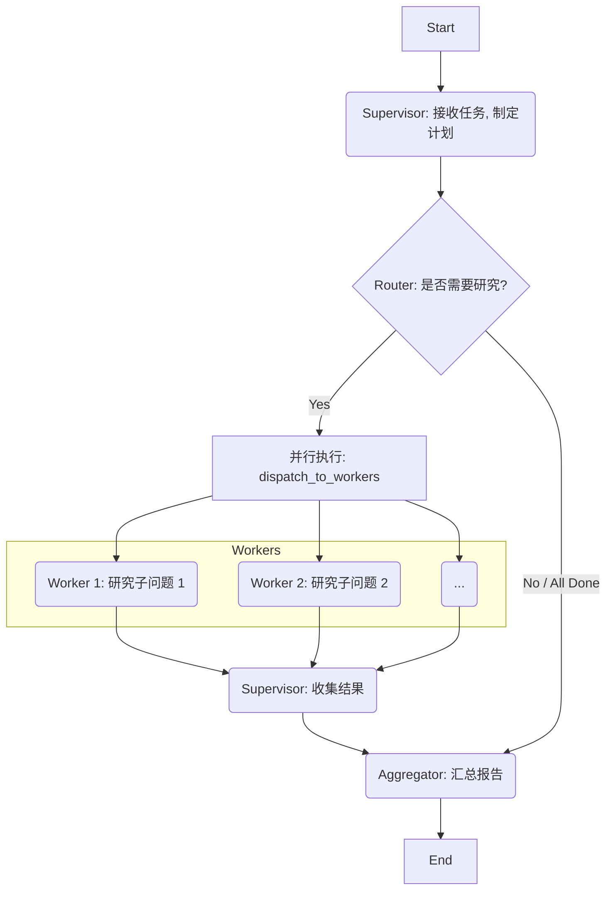

# 2.5 学术界的“GPT”：DeepResearch 深度研究助手从零到一创建与配置指南

> **导语**：欢迎来到我们第二周的毕业项目！在过去几天里，我们深入探索了 LangGraph 的世界，学习了如何用图的思维构建状态机、实现智能路由、持久化记忆、乃至人机与多智能体协作。现在，是时候将所有这些碎片化的知识拼凑起来，打造一个真正强大、完整、实用的应用了。在本项目中，我们将从零到一，创建并配置一个名为 **DeepResearch** 的深度研究助手。这个系统将模拟一个由“主管”和多个“研究员”组成的 AI 研究团队，能够对任意给定主题进行分工、并行搜索、并最终汇总成一份结构化的研究报告。这不仅是对本周所学知识的终极考验，更是一个可以作为你个人作品集亮点的、准生产级的 Agentic AI 项目。

## 目录
1.  **项目愿景：打造一个自动化 AI 研究团队**
    *   告别手动搜索：DeepResearch 要解决什么问题？
    *   团队架构：一个“主管”（Supervisor）+ 多个“研究员”（Workers）
    *   工作流程：规划 -> 并行研究 -> 汇总报告
2.  **架构设计：绘制 DeepResearch 的蓝图**
    *   **状态定义（`AgentState`）**：我们需要追踪哪些信息？（任务、计划、小组成员、历史消息等）
    *   **节点规划**：
        *   `Supervisor`: 核心大脑，负责任务分解和工作流管理。
        *   `Worker_Nodes`: 并行执行单元，每个 Worker 都是一个独立的 ReAct 风格 Agent。
        *   `Aggregator_Node`: 结果汇总节点。
    *   **图的拓扑结构**：一个动态的、层级化的协作图。
    *   Mermaid 图：可视化 DeepResearch 的完整工作流。
3.  **第一步：构建“研究员” Worker Agent**
    *   目标：创建一个可以执行搜索任务的、可复用的 ReAct Agent。
    *   工具定义：使用 `TavilySearchResults`。
    *   Agent 创建：使用 `create_openai_tools_agent` 创建一个标准的 `Runnable`。
    *   封装成函数：将其封装成一个接收 `messages` 和 `sender_name` 的节点函数。
4.  **第二步：构建“主管” Supervisor Agent**
    *   核心职责：任务分解、成员分配、流程控制。
    *   Supervisor Prompt 设计：赋予其“项目经理”的人格和决策逻辑。
    *   输出结构化：使用 Function Calling 让 Supervisor 输出结构化的计划和决策。
5.  **第三步：用 LangGraph 组装团队**
    *   定义图、节点和边，实现动态的 Worker 分配和调用。
    *   使用 `functools.partial` 动态创建多个 Worker 节点。
    *   实现 `router` 函数，根据 Supervisor 的决策，将任务分发给所有 Workers 或进行汇总。
6.  **第四步：接入持久化记忆**
    *   使用 `SqliteSaver` 为我们的研究任务提供断点续传能力。
    *   为每个研究任务分配一个唯一的 `thread_id`。
7.  **完整代码与运行指南**
    *   整合所有代码片段。
    *   运行 DeepResearch Agent，对一个复杂主题（如“AGI 的最新进展”）进行深度研究。
    *   观察控制台输出，理解 AI 团队是如何协同工作的。
8.  **项目总结与展望**
    *   DeepResearch 的优点与局限性。
    *   如何进一步扩展？（增加更多类型的 Worker、引入人类反馈环、优化报告生成等）
    *   你已经具备了构建复杂多智能体系统的能力！

---

## 1. 项目愿景：打造一个自动化 AI 研究团队

我们每天都会花费大量时间在信息检索上：为了写一份报告、学习一项新技术、或者了解一个行业动态。这个过程通常是繁琐的、重复的：打开搜索引擎、输入关键词、浏览多个网页、复制粘贴、总结归纳。

**DeepResearch** 的愿景，就是将这个过程**自动化**。我们希望创建一个 AI 系统，你只需要给它一个研究主题，它就能像一个训练有素的人类研究团队一样，自主地完成所有工作，并最终给你一份高质量的研究报告。

**团队架构**

一个高效的人类研究团队通常包含两种角色：
1.  **项目主管 (Supervisor)**：负责理解总体目标，将大任务分解为多个可执行的小任务，并将任务分配给合适的团队成员。
2.  **研究员 (Researcher/Worker)**：负责执行具体的小任务，比如“搜索 A 公司的财报”、“查找 B 技术的实现原理”等。

我们的 DeepResearch 系统将完美地复刻这种架构。

**工作流程**

1.  **规划 (Plan)**：用户提出一个复杂的研究主题（如“分析苹果 Vision Pro 的市场前景”）。`Supervisor` Agent 首先介入，将这个主题分解为一系列具体的子问题，例如：“Vision Pro 的核心技术是什么？”、“当前市场上有哪些竞争对手？”、“媒体和用户的初步评价如何？”、“它的定价策略和目标用户是谁？”。
2.  **并行研究 (Parallel Research)**：`Supervisor` 将这些子问题作为独立的任务，**同时**分配给多个 `Worker` Agent。每个 `Worker` 都是一个具备网络搜索能力的独立研究员。
3.  **汇总报告 (Aggregate)**：当所有的 `Worker` Agent 都完成了自己的研究任务后，一个 `Aggregator` 节点（或者由 `Supervisor` 亲自担任）会收集所有子问题的答案，并将它们整合成一份结构清晰、逻辑连贯的最终研究报告。

## 2. 架构设计：绘制 DeepResearch 的蓝图

**状态定义 (`AgentState`)**

我们的 `State` 需要比之前更复杂，以追踪整个团队的工作进展。

```python
from typing import TypedDict, Annotated, List, Optional
from langchain_core.messages import BaseMessage
import operator

class AgentState(TypedDict):
    task: str # 用户的初始研究任务
    plan: List[str] # 主管分解的任务计划列表
    messages: Annotated[List[BaseMessage], operator.add]
    team_members: List[str] # 团队成员列表 (e.g., "Researcher", "Coder")
    # 用于存储每个 worker 的结果，key 是 worker 的名字
    worker_outputs: Annotated[dict, operator.ior_] 
    next: str # 下一个要执行的节点名
```

**节点规划**

*   `supervisor`: 接收初始 `task`，生成 `plan`，并决定下一步是分派任务 (`dispatch`) 还是汇总 (`aggregate`)。
*   `research_worker`: 一个可复用的节点函数，可以根据分配给它的具体任务执行研究。
*   `aggregator`: 收集所有 `worker_outputs` 并生成最终报告。

**图的拓扑结构**

这是一个层级与并行结合的结构。

**Mermaid 图：可视化 DeepResearch 的完整工作流**



## 3. 第一步：构建“研究员” Worker Agent

Worker 是我们团队的基石。它应该是一个功能单一、性能可靠的 ReAct 风格 Agent。我们将创建一个通用的函数，它可以实例化并运行一个具备搜索能力的 Worker。

```python
# deep_research.py
from langchain_openai import ChatOpenAI
from langchain_core.prompts import ChatPromptTemplate
from langchain.agents import create_openai_tools_agent, AgentExecutor
from langchain_community.tools.tavily_search import TavilySearchResults

# 1. 定义 Worker Agent 的工具
worker_tools = [TavilySearchResults(max_results=4)]

# 2. 定义 Worker Agent 的 Prompt
worker_prompt = ChatPromptTemplate.from_messages([
    ("system", "You are a research assistant. You must use the provided tools to answer the user's question."),
    ("user", "{input}")
])

# 3. 创建 Worker Agent 的 Runnable
def create_worker_agent_runnable():
    llm = ChatOpenAI(model="deepseek-chat")
    agent = create_openai_tools_agent(llm, worker_tools, worker_prompt)
    return AgentExecutor(agent=agent, tools=worker_tools, verbose=True)

# 4. 封装成一个可供 LangGraph 调用的节点函数
def worker_node(state: AgentState, agent_runnable, worker_name: str):
    # 根据 worker_name 从 plan 中找到分配给自己的任务
    # 为了简化，我们假设 plan 就是一个任务列表，按顺序分配
    # 现实中，这里的任务分配会更复杂
    task = state['plan'][state['team_members'].index(worker_name)]
    
    # 运行 ReAct Agent
    result = agent_runnable.invoke({"input": task})
    
    # 返回结果，用 worker_name 作为 key
    return {"worker_outputs": {worker_name: result['output']}}
```

## 4. 第二步：构建“主管” Supervisor Agent

Supervisor 是团队的大脑。它的核心是 Prompt，我们需要在这个 Prompt 中赋予它分解任务和管理团队的能力。

```python
# deep_research.py (续)
from langchain_core.pydantic_v1 import BaseModel, Field

# 1. 定义 Supervisor 的输出数据结构
class Plan(BaseModel):
    """A plan to complete a research task, broken down into simple steps."""
    steps: List[str] = Field(description="A list of simple, actionable steps to research.")

# 2. 创建 Supervisor 的 Prompt
supervisor_prompt = ChatPromptTemplate.from_messages([
    ("system", """You are a supervisor of a team of AI research agents. 
    Given a user's research request, your job is to create a detailed, step-by-step plan to address it.
    Each step in the plan will be executed by a dedicated researcher.
    Do not try to answer the question yourself, only create the plan."""),
    ("user", "Research task: {task}")
])

# 3. 创建 Supervisor 的 Runnable
llm = ChatOpenAI(model="gpt-4-turbo") # 主管建议使用更强大的模型
structured_llm = llm.with_structured_output(Plan)
supervisor_runnable = supervisor_prompt | structured_llm
```

## 5. 第三步：用 LangGraph 组装团队

这是最关键的一步，我们将使用 LangGraph 将 Supervisor 和多个 Worker 组装成一个协同工作的图。

```python
# deep_research.py (续)
import functools
from langgraph.graph import StatefulGraph, END

# --- 1. 创建节点 ---

# Supervisor 节点
def supervisor_node(state: AgentState):
    print("--- Calling Supervisor Node ---")
    plan = supervisor_runnable.invoke({"task": state['task']})
    print(f"Plan: {plan.steps}")
    # 假设有多少步，就创建多少个 worker
    team_members = [f"Researcher_{i+1}" for i in range(len(plan.steps))]
    return {
        "plan": plan.steps,
        "team_members": team_members,
        "next": "run_workers" # 决定下一步走向
    }

# Worker 节点 (使用 functools.partial 动态创建)
# 我们为每个 team_member 创建一个独立的、可调用的节点
worker_runnables = {name: create_worker_agent_runnable() for name in ["Researcher_1", "Researcher_2", "Researcher_3"]} # 预先创建
worker_nodes = []
for member in ["Researcher_1", "Researcher_2", "Researcher_3"]:
    node = functools.partial(worker_node, agent_runnable=worker_runnables[member], worker_name=member)
    worker_nodes.append(node)

# 聚合节点
def aggregator_node(state: AgentState):
    print("--- Calling Aggregator Node ---")
    all_outputs = "\n\n".join(state['worker_outputs'].values())
    
    # 最后调用一次 LLM 来生成最终报告
    final_prompt = ChatPromptTemplate.from_messages([
        ("system", "You are a senior research analyst. Your task is to synthesize the research findings from your team into a coherent, well-structured final report."),
        ("user", "Research Task: {task}\n\nTeam Findings:\n{findings}")
    ])
    final_report_runnable = final_prompt | llm
    final_report = final_report_runnable.invoke({
        "task": state['task'],
        "findings": all_outputs
    })
    return {"messages": [final_report]}


# --- 2. 定义图 ---
workflow = StatefulGraph(AgentState)

workflow.add_node("supervisor", supervisor_node)
workflow.add_node("aggregator", aggregator_node)
# 将多个并行节点作为一个整体添加到图中
for i, worker_node_func in enumerate(worker_nodes):
    workflow.add_node(f"worker_{i+1}", worker_node_func)


# --- 3. 定义边 ---
workflow.set_entry_point("supervisor")

# 从 supervisor 分发到所有 workers
# LangGraph 会自动等待所有并行分支完成后再继续
for i in range(len(worker_nodes)):
    workflow.add_edge("supervisor", f"worker_{i+1}")

# 所有 workers 完成后，走向 aggregator
for i in range(len(worker_nodes)):
    workflow.add_edge(f"worker_{i+1}", "aggregator")

workflow.add_edge("aggregator", END)

# 编译图
app = workflow.compile()
```
*（这是一个简化的拓扑。在真实的 LangGraph 中，并行执行和聚合的定义会使用更高级的 `add_node` 和条件边逻辑，但核心思想是相同的：从一个点分叉，再汇聚到一个点。）*

## 6. 第四步：接入持久化记忆

对于可能耗时数分钟甚至数小时的深度研究任务，持久化是必须的。

```python
# deep_research.py (续)
from langgraph.checkpoint.sqlite import SqliteSaver

memory_saver = SqliteSaver.from_conn_string("sqlite:///deep_research.sqlite")

# 传入 checkpointer 编译
app = workflow.compile(checkpointer=memory_saver)
```

## 7. 完整代码与运行指南

将以上所有代码整合到一个 `deep_research.py` 文件中。然后，在文件末尾添加运行代码：

```python
# deep_research.py (末尾)
import uuid

# 为这次研究任务创建一个唯一的 ID
thread_id = str(uuid.uuid4())
config = {"configurable": {"thread_id": thread_id}}

task = "Analyze the market landscape and future trends for AI-powered code generation tools."

# 开始运行
inputs = {"task": task, "messages": []}
for output in app.stream(inputs, config):
    for key, value in output.items():
        print(f"--- Output from node '{key}' ---")
        print(value)
        print("\n")
```

在终端运行 `python deep_research.py`。你将看到一场 AI 团队协作的大戏：
1.  **Supervisor** 首先输出它制定的研究计划。
2.  然后，多个 **Researcher** 节点开始**并行**工作，它们的 `verbose=True` 日志会交错出现。
3.  当所有 Researcher 都完成后，**Aggregator** 节点被触发。
4.  最后，你会得到一份由 AI 团队为你精心准备的、关于“AI 代码生成工具市场”的深度研究报告。
5.  所有中间状态都被保存在 `deep_research.sqlite` 文件中。你可以随时中断，然后用相同的 `thread_id` 恢复任务。

## 8. 项目总结与展望

**DeepResearch 的优点与局限性**

*   **优点**：
    *   **自动化**：将繁琐的研究工作流完全自动化。
    *   **效率**：通过并行处理，大大缩短了研究时间。
    *   **结构化**：通过“规划-执行-汇总”的模式，保证了研究的广度和深度。
    *   **可扩展**：可以轻易地增加更多、更专业的 Worker Agent。
*   **局限性**：
    *   **成本较高**：每个 Agent 的运行和最终的汇总都需要多次 LLM 调用。
    *   **稳定性**：任意一个 Worker Agent 的失败都可能影响最终结果的质量。
    *   **规划质量**：最终报告的质量高度依赖于 Supervisor 最初制定的计划的质量。

**如何进一步扩展？**

*   **增加 Worker 类型**：加入一个 `code_execution_agent` 来验证生成的代码，或者一个 `chart_generation_agent` 来生成数据图表。
*   **引入人类反馈环**：在 Supervisor 制定完计划后，或者在 Aggregator 生成最终报告前，加入一个“人类批准”节点，让人类专家来审核和修正。
*   **迭代式研究**：让 Supervisor 在看到第一轮的研究结果后，能够决定是否需要进行第二轮、更深入的研究，形成一个更大的研究循环。

通过完成 DeepResearch 项目，你已经不再只是一个 Agent 的使用者，你已经成为一个能够设计、组织和指挥 AI 团队协同作战的“AI 架构师”。你所掌握的，是构建下一代复杂、智能应用系统的核心能力。
