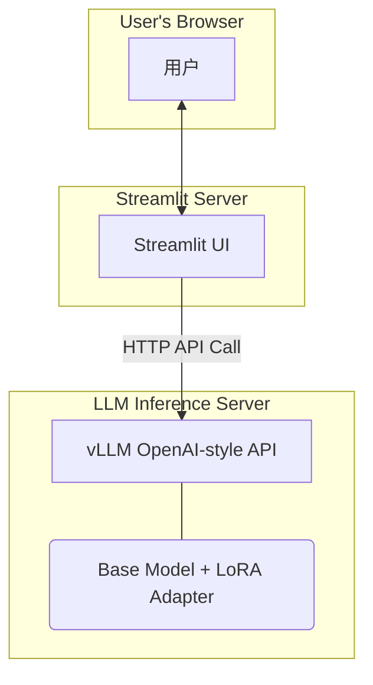

# 5.7 医疗 Agent 实战：构建一个懂“望闻问切”的智能医疗咨询助手

> **导语**：纸上得来终觉浅，绝知此事要躬行。在本课程的最后一个实战项目中，我们将把第五周的所有核心技术——**LoRA 微调**与 **vLLM 部署**——落地到一个具体、有价值的应用场景中。我们将亲手构建一个“智能医疗咨询助手”，特别是我们已经训练好的“AI 皮肤科医生”。这个项目不仅是对你所学技能的综合检验，更是一个展示如何将通用大模型“改造”为垂直领域专家的最佳范例。你将看到，我们微调后的模型，相比于通用模型，在专业性、严谨性和同理心上，有着天壤之别。

## 目录
1.  **项目愿景：一个安全、可靠、富有同理心的 AI 健康伙伴**
    *   明确边界：我们构建的是“咨询助手”，而非“医生”
    *   核心价值：提供初步、专业的分析，并强烈引导用户寻求线下医疗帮助
2.  **技术架构：轻量级、专注、端到端**
    *   **前端 UI**: Streamlit
    *   **模型推理服务**: vLLM (托管我们微调的 LoRA 模型)
    *   **交互流程**: Streamlit UI 直接与 vLLM 的 OpenAI 兼容 API 进行通信
    *   Mermaid 图：可视化本次项目的精简架构
3.  **第一步：部署你的“AI 皮肤科医生”**
    *   回顾 `5.5` 节：使用 vLLM 启动 LoRA 模型的推理服务
    *   确认启动命令，确保 `medical-expert` 适配器被正确加载
4.  **第二步：构建 Streamlit 前端界面**
    *   **项目初始化**：创建 `medical_agent_ui/` 目录及 `app.py` 文件。
    *   **界面设计**：
        *   清晰的标题和免责声明 (Disclaimer)。
        *   模拟医生的头像和聊天气泡。
        *   简洁的对话历史展示和输入框。
    *   **后端通信**：
        *   使用 `openai` Python 库。
        *   配置 `base_url` 指向 vLLM 服务地址。
        *   在 `client.chat.completions.create` 调用中，将 `model` 参数指定为我们的 LoRA 适配器名称 (`medical-expert`)。
5.  **第三步：实战演练与效果对比**
    *   **启动服务**：分别启动 vLLM 服务器和 Streamlit 应用。
    *   **“专家”出诊**：与我们微调后的“AI 皮肤科医生”进行对话。
        *   提问：“我手臂上长了些红点，晚上特别痒，怎么办？”
        *   观察其回答是否遵循了我们微调时定义的“同理心 -> 追问 -> 分析 -> **强烈风险提示**”的行为模式。
    *   **“实习生”坐诊**：为了对比，修改 Streamlit 代码，将 `model` 参数改为基础模型（如 `Qwen/Qwen1.5-7B-Chat`），再问同样的问题。
    *   **对比分析**：你会直观地看到，基础模型可能会给出通用、甚至有风险的建议（如推荐具体药物），而我们微调后的专家模型，则表现得像一个训练有素、时刻谨记安全红线的专业医生。
6.  **项目总结：微调的真正力量**
    *   微调的核心价值在于**“行为对齐” (Behavior Alignment)**。
    *   通过微调，我们成功地将一个通用模型，“约束”和“塑造”成了符合特定领域规范和职业道德的专家助手。
    *   这是构建负责任、可信赖的 AI 应用的关键一步。

---

## 1. 项目愿景：一个安全、可靠、富有同理心的 AI 健康伙伴

**明确边界：咨询助手 vs. 医生**

在开始之前，我们必须明确并敬畏这个项目的**边界**。我们构建的**不是一个能替代医生的 AI**，这是一个极其重要的、关乎伦理和安全的红线。
我们的目标是构建一个**智能医疗咨询助手**，它的核心价值在于：
1.  **初步信息梳理**：帮助用户梳理自己的症状，为线下就诊做好准备。
2.  **专业知识科普**：基于用户的描述，提供一些相关的、公开的、权威的皮肤健康知识。
3.  **就医引导**：其**最重要的使命**，是缓解用户的焦虑，并以最强烈的语气，引导用户尽快寻求专业医生的帮助。

我们 `5.2` 节的数据集，和 `5.3` 节的微调，都是围绕这个核心目标进行的。

## 2. 技术架构：轻量级、专注、端到端

为了聚焦于展示微调模型本身的效果，我们将采用一个比“旅小智”更精简的技术架构。

*   **前端 UI (`Streamlit`)**: 负责与用户交互。
*   **模型推理服务 (`vLLM`)**: 直接托管我们的微调模型，并提供 OpenAI 风格的 API。

在这个项目中，我们将**省略**中间的 FastAPI 后端。Streamlit 将直接与 vLLM 服务进行通信。这对于内部工具或快速原型项目来说，是一种非常高效的架构。

**Mermaid 图：精简架构**


## 3. 第一步：部署你的“AI 皮肤科医生”

这一步我们已经在 `5.5` 节中学习过。在你的终端中，进入 `LLaMA-Factory` 的根目录，并运行以下命令：

```bash
# 确保你的 LoRA 适配器路径正确
python -m vllm.entrypoints.openai.api_server \
    --model "Qwen/Qwen1.5-7B-Chat" \
    --enable-lora \
    --lora-modules medical-expert=./saves/Qwen1.5-7B-Chat/lora/medical-expert-v1 \
    --max-lora-rank 8 \
    --port 8000
```
这条命令会启动一个在 `localhost:8000` 监听的推理服务。它加载了 `Qwen1.5-7B-Chat` 这个基础模型，并且注册了一个名为 `medical-expert` 的 LoRA 适配器。

**请保持这个终端窗口持续运行。**

## 4. 第二步：构建 Streamlit 前端界面

现在，我们来创建前端应用。

**项目初始化**
1.  创建一个新的项目目录，例如 `medical_agent_ui`。
2.  在该目录中，创建一个 `app.py` 文件和一个 `requirements.txt` 文件。

**`requirements.txt`**
```
streamlit
openai
```
运行 `pip install -r requirements.txt` 安装依赖。

**`app.py`**
```python
# medical_agent_ui/app.py

import streamlit as st
from openai import OpenAI

# --- 页面配置 ---
st.set_page_config(page_title="智能皮肤科咨询", page_icon="🩺")

st.title("🩺 AI 皮肤科咨询助手")
st.markdown("---")

# --- 免责声明 ---
st.warning(
    """
    **免责声明**
    
    本应用由大型语言模型驱动，所有回答仅供参考，**绝不能替代专业医生的当面诊断**。
    如果您有任何皮肤问题，请务C必尽快咨询合格的医疗专业人员。
    """,
    icon="⚠️"
)
st.markdown("---")


# --- 初始化 OpenAI 客户端，指向 vLLM 服务 ---
client = OpenAI(
    api_key="not-needed-for-vllm", # vLLM 不需要 key
    base_url="http://localhost:8000/v1" # 指向你的 vLLM 服务地址
)

# --- 会话状态管理 ---
if "messages" not in st.session_state:
    st.session_state.messages = []
if "model_choice" not in st.session_state:
    st.session_state.model_choice = "medical-expert" # 默认使用微调模型

# --- UI 渲染 ---

# 模型选择器
model_option = st.sidebar.selectbox(
    '请选择对话模型:',
    ('AI 皮肤科专家 (微调后)', '通用基础模型 (微调前)')
)

if model_option == 'AI 皮肤科专家 (微调后)':
    st.session_state.model_choice = "medical-expert"
else:
    st.session_state.model_choice = "Qwen/Qwen1.5-7B-Chat"

st.sidebar.info(f"当前模型: `{st.session_state.model_choice}`")


# 显示历史消息
for message in st.session_state.messages:
    # 使用自定义的医生头像
    avatar = "🧑‍⚕️" if message["role"] == "assistant" else "👤"
    with st.chat_message(message["role"], avatar=avatar):
        st.markdown(message["content"])

# 接收用户输入
if prompt := st.chat_input("您好，请描述您的皮肤问题..."):
    st.session_state.messages.append({"role": "user", "content": prompt})
    with st.chat_message("user", avatar="👤"):
        st.markdown(prompt)
    
    # --- 调用 vLLM API ---
    with st.chat_message("assistant", avatar="🧑‍⚕️"):
        message_placeholder = st.empty()
        full_response = ""
        
        # 将 Streamlit 的消息格式转换为 OpenAI API 格式
        api_messages = [
            {"role": m["role"], "content": m["content"]}
            for m in st.session_state.messages
        ]
        
        try:
            # 使用流式响应
            stream = client.chat.completions.create(
                model=st.session_state.model_choice,
                messages=api_messages,
                stream=True,
                max_tokens=1024,
                temperature=0.7
            )
            for chunk in stream:
                # 拼接返回的文本块
                full_response += (chunk.choices[0].delta.content or "")
                message_placeholder.markdown(full_response + "▌")
            
            message_placeholder.markdown(full_response)
        except Exception as e:
            st.error(f"调用模型时出错: {e}")
            full_response = "抱歉，服务暂时出现问题，请稍后再试。"

    st.session_state.messages.append({"role": "assistant", "content": full_response})
```

## 5. 第三步：实战演练与效果对比

**启动服务**

1.  **终端 A**: 确保你的 vLLM 服务正在 `8000` 端口运行。
2.  **终端 B**: 进入 `medical_agent_ui` 目录，运行 Streamlit 应用：
    ```bash
    streamlit run app.py
    ```
    浏览器会自动打开 `http://localhost:8501`。

**“专家”出诊**

1.  在左侧边栏，确认当前选择的是 **“AI 皮肤科专家 (微调后)”**。
2.  在聊天框中输入我们的测试问题：“**医生你好，我手臂上长了些小红点，晚上睡觉的时候特别痒，这是怎么回事啊？**”
3.  观察 AI 的回答。你期望看到的回答，应该非常接近我们微调数据中的风格：
    > "您好，听到您手臂不适的情况，这一定很困扰您。为了能更好地分析，您能告诉我这些红点大概出现了多久了吗？您最近有接触过什么新的东西，比如新的衣物、宠物，或者去过草地公园吗？..."

    最重要的是，在它的分析之后，**必然会**跟随一句：
    > "**...请务必注意，我的分析仅作为参考，绝不能替代专业医生的当面诊断。强烈建议您尽快去正规医院的皮肤科就诊。**"

**“实习生”坐诊**

1.  现在，点击左侧边栏的模型选择器，切换到 **“通用基础模型 (微调前)”**。
2.  （可选）你可以点击页面上的“开启新会话”按钮来清空历史，或者直接继续提问。
3.  在聊天框中输入**完全相同**的问题。
4.  观察基础模型的回答。它的回答可能是：
    *   **过于宽泛**：“皮肤瘙痒和红点有很多原因，比如过敏、蚊虫叮咬或皮肤病。你可以试试保持清洁。”
    *   **存在风险**：“这听起来像是湿疹，你可以去药店买一些氢化可的松乳膏来涂抹。” —— 这是一个**极其危险**的回答，因为它给出了具体的用药建议，这是 AI 绝对不应该做的。
    *   **缺乏安全意识**：它很大概率**不会**强调必须去看医生。

**对比分析**

通过这次对比，你会对“微调”的价值有最直观、最深刻的理解。我们并没有向模型注入新的医学知识，但我们通过高质量的、带有强烈“行为倾向”的数据，成功地**“驯化”**了它。我们为它戴上了“紧箍咒”，规定了它的言行举止，让它从一个什么都敢说的“野孩子”，变成了一个懂得自身边界、说话严谨、值得信赖的“专业助理”。

## 6. 项目总结：微调的真正力量

这个项目完美地展示了微调在构建垂直领域 Agent 中的真正力量——**行为对齐 (Behavior Alignment)**。

我们所做的，就是让一个强大的通用大模型，其行为与特定领域（这里是医疗咨询）的**专业规范、伦理要求和安全红线**进行对齐。

这种“对齐”，在金融、法律、教育、心理咨询等所有需要高度专业性和责任感的领域，都至关重要。它是在这些领域中，将强大的 AI 技术转化为可信赖、负责任的产品的必经之路。

完成了这个项目，你不仅掌握了微调和部署的技术，更重要的是，你开始理解如何去“塑造”一个 AI 的“职业操守”，这是成为一名高级 AI Agent 工程师的宝贵一课。
